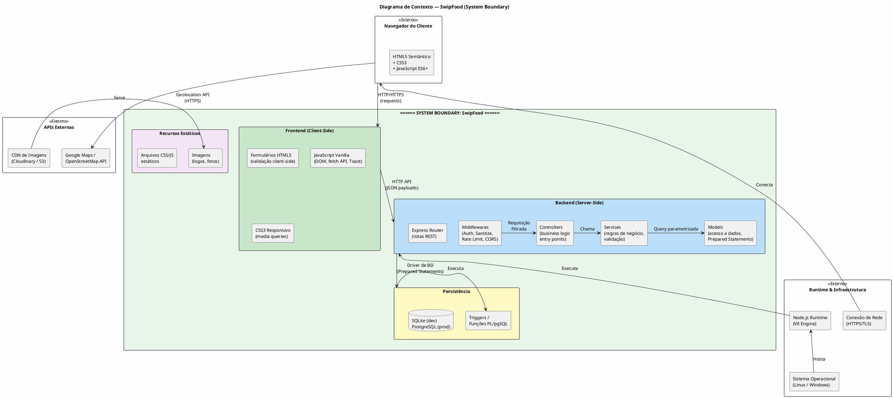

# Escopo do Projeto — SwipFood

**Projeto:** SwipFood — Plataforma de Avaliação de Restaurantes  
**Normas de Referência:** PMBOK 7ª Ed. · OMG UML 2.5.1 · ISO/IEC/IEEE 29148:2018  
**Stack Tecnológica:** Frontend HTML5 semântico, CSS3, JavaScript Vanilla/ES6+ · Backend Node.js com Express · SQLite/PostgreSQL com Prepared Statements  
**Versão do Documento:** 1.0  
**Data:** 10/09/2026  

---

## Índice

1. [Justificativa de Engenharia e Objetivos SMART](#1-justificativa-de-engenharia-e-objetivos-smart)
2. [Delimitação das Fronteiras do Sistema (System Boundary)](#2-delimitação-das-fronteiras-do-sistema-system-boundary)
3. [Escopo do Produto por Módulos Arquiteturais](#3-escopo-do-produto-por-módulos-arquiteturais)
4. [Diagrama de Componentes UML 2.5.1](#4-diagrama-de-componentes-uml-251)
5. [Diagrama de Implantação (Deployment Diagram)](#5-diagrama-de-implantação-deployment-diagram)
6. [Estrutura Analítica do Projeto (EAP / WBS)](#6-estrutura-analítica-do-projeto-eap--wbs)
7. [Limites Explícitos do Projeto](#7-limites-explícitos-do-projeto)
8. [Matriz de Critérios de Aceitação](#8-matriz-de-critérios-de-aceitação)
9. [Matriz de Restrições e Premissas](#9-matriz-de-restrições-e-premissas)
10. [Matriz de Riscos Técnicos](#10-matriz-de-riscos-técnicos)
11. [Governança e Processo de Controle de Mudanças de Escopo](#11-governança-e-processo-de-controle-de-mudanças-de-escopo)

---

## 1. Justificativa de Engenharia e Objetivos SMART

### 1.1 Justificativa de Engenharia

O mercado de restauração no Brasil conta com milhões de estabelecimentos, mas a informação sobre a qualidade real destes lugares permanece fragmentada em plataformas genéricas de avaliações. O **SwipFood** surge como uma solução full-stack para preencher essa lacuna, oferecendo um sistema de avaliação que vai além da nota genérica, com critérios específicos e granulares sobre a **qualidade da comida** (limpeza do local, manuseio dos alimentos, custo-benefício) e a **qualidade do ambiente** (conforto, iluminação, atendimento, estacionamento, espaço infantil).

A escolha tecnológica por **Node.js + Express** no backend justifica-se por:

- **Performance de I/O**: O Event Loop não bloqueante do Node.js é ideal para operações de banco de dados e chamadas a APIs externas (mapas), permitindo alta concorrência com baixo consumo de recursos.
- **Ecossistema npm**: Acesso a bibliotecas maduras para autenticação (jsonwebtoken), validação (express-validator), hashing (bcrypt), upload (multer) e compressão (compression).
- **Unidade de linguagem**: O frontend (JavaScript Vanilla/ES6+) e o backend (Node.js) compartilham a mesma linguagem, reduzindo custos de treinamento e facilitando a manutenção.
- **SQLite para dev / PostgreSQL para prod**: Flexibilidade de prototipagem rápida com SQLite em desenvolvimento, escalabilidade horizontal com PostgreSQL em produção.
- **Arquitetura simples**: Sem a complexidade de frameworks monolíticos, o projeto é adequado para equipes pequenas e para fins acadêmicos/projetos de desenvolvimento de sistemas.

A escolha por **HTML5 semântico + CSS3 + JavaScript Vanilla** no frontend justifica-se por:

- **Acessibilidade nativa**: Elementos semânticos (`<header>`, `<main>`, `<article>`, `<nav>`) melhoram a acessibilidade e SEO.
- **Performance**: Zero dependência de frameworks JavaScript no lado do cliente, resultando em carregamento mais rápido.
- **Manutenibilidade**: Código puro sem camadas de abstração, ideal para projetos de escala moderada.

### 1.2 Objetivos SMART

| Objetivo | SMART | Descrição |
|----------|-------|-----------|
| **O1** | **S**pecífico | Desenvolver uma plataforma web full-stack que permita aos usuários autenticados avaliar restaurantes com notas granulares sobre comida e ambiente, e que permita aos administradores gerenciar todo o ciclo de vida dos estabelecimentos. |
| **O1** | **M**ensurável | Entregar um sistema funcional com: (a) 7+ campos de avaliação da comida, 8+ campos de avaliação do ambiente; (b) CRUD completo de restaurantes; (c) autenticação JWT; (d) painel administrativo com dashboard; (e) filtros combináveis funcionais; (f) integração com API de mapas. |
| **O1** | **A**lcançável | Utilizando stack tecnológica familiar (Node.js, Express, HTML5, JavaScript Vanilla) com ecossistema robusto de bibliotecas, o projeto é alcançável com recursos de equipe reduzida e prazo de 8 semanas de desenvolvimento. |
| **O1** | **R**elevante | Soluciona a necessidade real de consumidores que buscam informações confiáveis e granulares sobre restaurantes, proporcionando dados que as plataformas genéricas não oferecem de forma estruturada. |
| **O1** | **T**emporal | Entrega funcional do MVP (Mínimo Viável Product) em **8 semanas**, com incrementos subsequentes a cada 2 semanas para funcionalidades estendidas (favoritos, relatórios, notificações). |

---

## 2. Delimitação das Fronteiras do Sistema (System Boundary)

### 2.1 Descrição da Fronteira

O **System Boundary** do SwipFood delimita claramente o que está **dentro** do controle do sistema e o que é **externo** (dependência de terceiros ou infraestrutura).

**Dentro da fronteira do sistema (controláveis):**
- Interface HTML5 client-side (páginas, formulários, componentes DOM)
- Servidor Node.js com Express (rotas, middlewares, controllers, services)
- Lógica de aplicação (validação, sanitização, autenticação, autorização)
- Scripts de banco de dados (DDL, triggers, funções)
- Arquivos estáticos (CSS, JavaScript client-side, imagens)

**Fora da fronteira do sistema (não controláveis):**
- Infraestrutura de hospedagem (servidor físico/virtual)
- Runtime V8 do Node.js (motor de execução)
- Engine do banco de dados (PostgreSQL server / SQLite library)
- APIs externas (Google Maps / OpenStreetMap)
- Navegador do cliente (Chrome, Firefox, Safari, Edge)
- Conexão de rede do usuário
- CDN para distribuição de imagens

### 2.2 Diagrama de Contexto — PlantUML



---

## 3. Escopo do Produto por Módulos Arquiteturais

### 3.1 Módulo 1: Interface HTML5/JS (Frontend)

**Responsabilidade:** Renderizar páginas, formulários, componentes DOM e interagir com o backend via `fetch()` API.

| Entregável | Descrição | Arquivos |
|------------|-----------|----------|
| Página inicial | Listagem pública de restaurantes com filtros | `public/index.html`, `public/css/home.css`, `public/js/home.js` |
| Página de detalhes do restaurante | Dados completos, mapa, avaliações | `public/restaurante.html`, `public/css/restaurante.css`, `public/js/restaurante.js` |
| Página de login | Formulário de autenticação | `public/login.html`, `public/css/auth.css`, `public/js/auth.js` |
| Página de registro | Formulário de cadastro de novo usuário | `public/registro.html`, `public/css/auth.css`, `public/js/auth.js` |
| Página de avaliação | Formulário com 8+ campos, validação client-side, upload de fotos | `public/avaliar.html`, `public/css/avaliar.css`, `public/js/avaliar.js` |
| Página de perfil | Dados do usuário, histórico de avaliações | `public/perfil.html`, `public/css/perfil.css`, `public/js/perfil.js` |
| Painel administrativo | Dashboard, CRUD restaurantes, moderação | `admin/index.html`, `admin/restaurantes.html`, `admin/avaliacoes.html`, `admin/usuarios.html`, `admin/css/admin.css`, `admin/js/admin.js` |
| Componentes reutilizáveis | Toast, Modal, Navbar, Footer, Card de restaurante | `public/js/components/toast.js`, `public/js/components/modal.js`, `public/js/components/navbar.js`, `public/js/components/card.js` |
| Utilitários | Validação de formulário, sanitização, formatação | `public/js/utils/validacao.js`, `public/js/utils/sanitize.js`, `public/js/utils/format.js` |
| Estilos globais | Reset CSS, variáveis CSS, responsividade | `public/css/reset.css`, `public/css/variaveis.css`, `public/css/responsivo.css` |

### 3.2 Módulo 2: Servidor Node.js (Backend)

**Responsabilidade:** Servir rotas HTTP REST, executar middlewares, processar lógica de negócio e coordenar acesso ao banco de dados.

| Entregável | Descrição | Arquivos |
|------------|-----------|----------|
| Entry point | Configuração do Express, rotas, middlewares globais | `src/server.js` |
| Configuração | Variáveis de ambiente, CORS, database connection | `src/config/database.js`, `src/config/cors.js`, `src/config/env.js` |
| Rotas públicas | Definição de endpoints públicos | `src/routes/publicas.js` |
| Rotas autenticadas | Definição de endpoints protegidos por JWT | `src/routes/autenticadas.js` |
| Rotas administrativas | Definição de endpoints protegidos por role admin | `src/routes/admin.js` |
| Controllers | Orquestração de requests → services → models → response | `src/controllers/authController.js`, `src/controllers/restauranteController.js`, `src/controllers/avaliacaoController.js`, `src/controllers/usuarioController.js`, `src/controllers/adminController.js` |
| Services | Regras de negócio, validação, orquestração | `src/services/authService.js`, `src/services/restauranteService.js`, `src/services/avaliacaoService.js`, `src/services/usuarioService.js`, `src/services/adminService.js`, `src/services/auditoriaService.js`, `src/services/mapaService.js` |
| Models | Acesso a dados com Prepared Statements | `src/models/usuarioModel.js`, `src/models/restauranteModel.js`, `src/models/avaliacaoModel.js`, `src/models/tagModel.js`, `src/models/auditLogModel.js` |
| Middlewares | Cross-cutting concerns | `src/middlewares/authMiddleware.js`, `src/middlewares/adminMiddleware.js`, `src/middlewares/sanitizeBody.js`, `src/middlewares/sanitizeQuery.js`, `src/middlewares/rateLimiter.js`, `src/middlewares/errorHandler.js`, `src/middlewares/uploadMiddleware.js` |
| Validadores | Regras de validação com express-validator | `src/validators/authValidator.js`, `src/validators/avaliacaoValidator.js`, `src/validators/restauranteValidator.js` |
| Utilitários server-side | Hash de senhas, geração de tokens, formatação | `src/utils/hash.js`, `src/utils/token.js`, `src/utils/logger.js` |

### 3.3 Módulo 3: Persistência (Banco de Dados)

**Responsabilidade:** Armazenar dados, garantir integridade referencial, executar triggers e funções de atualização automática.

| Entregável | Descrição | Arquivos |
|------------|-----------|----------|
| Schema DDL | Script completo de criação de tabelas | `db/migrations/001_criar_tabelas.sql` |
| Dados iniciais | Seeds (tags, admin padrão) | `db/seeds/001_tags_iniciais.sql`, `db/seeds/002_admin_inicial.sql` |
| Triggers | Função e triggers de atualização de nota média | `db/migrations/002_triggers_nota_media.sql` |
| Índices | Scripts de criação de índices de performance | `db/migrations/003_indices_performance.sql` |
| Configuração de BD | Conexão SQLite (dev) / PostgreSQL (prod) | `src/config/database.js` |
| Migrations | Sistema de versionamento do schema | `db/migrations/` (sequenciais com timestamps) |

### 3.4 Módulo 4: Configuração e Infraestrutura

**Responsabilidade:** Gerenciar variáveis de ambiente, scripts npm, e configuração do projeto.

| Entregável | Descrição | Arquivos |
|------------|-----------|----------|
| package.json | Dependências, scripts npm | `package.json` |
| Variáveis de ambiente | Template de configuração | `.env.example`, `.env.development`, `.env.production` |
| Gitignore | Arquivos ignorados pelo Git | `.gitignore` |
| Documentação do projeto | README com instruções de setup | `README.md` |
| Scripts npm | start, dev, test, migrate, seed, lint | `package.json` → `scripts` |
| Configuração ESLint | Regras de linting | `.eslintrc.js` |

---

## 4. Diagrama de Componentes UML 2.5.1

O diagrama de componentes UML 2.5.1 modela a estrutura estática do sistema, mostrando as dependências entre componentes e as **portas** e **interfaces providas/requeridas** conforme a especificação UML 2.5.1 §11.

```plantuml
@startuml
skinparam backgroundColor #FEFEFE
skinparam componentStyle rectangle
skinparam defaultFontSize 12
skinparam interfaceBackgroundColor #E3F2FD
skinparam interfaceBorderColor #1565C0

title Diagrama de Componentes — SwipFood (UML 2.5.1)

package "Frontend (HTML5/JS)" as FE_PKG {

  component [Páginas HTML5\nSemânticas] as HTML_C {
    portin " " as HTML_PORT_IN
    portout " " as HTML_PORT_OUT
  }

  component [Controlador Client-Side\n(JavaScript ES6+)] as JSFE_C {
    portin " " as JS_PORT_IN
    portout " " as JS_PORT_OUT
    portout " " as JS_FETCH_PORT
  }

  component [Estilização\n(CSS3 Responsivo)] as CSS_C

  component [Componentes DOM\n(Toast, Modal, Card)] as COMP_C {
    portout " " as COMP_PORT_OUT
  }

  HTML_C -right- JSFE_C
  JSFE_C -right- COMP_C
  CSS_C .. HTML_C
}

package "Backend (Node.js/Express)" as BE_PKG {

  component [Express Router\n(Rotas REST)] as ROUTER_C {
    portin "HTTP Request" as ROUTER_PORT_IN
    portout "Requisição\nFiltrada" as ROUTER_PORT_OUT
  }

  component [Pipeline de Middlewares\n(Auth, Sanitize,\nRate Limit, CORS)] as MW_C {
    portin " " as MW_PORT_IN
    portout " " as MW_PORT_OUT
    portin " " as MW_PORT_IN2
  }

  component [Controllers\n(AvaliacaoCtrl,\nRestauranteCtrl,\nAuthCtrl, etc.)] as CTRL_C {
    portin " " as CTRL_PORT_IN
    portout " " as CTRL_PORT_OUT
  }

  component [Services\n(Business Logic)] as SVC_C {
    portin " " as SVC_PORT_IN
    portout " " as SVC_PORT_OUT
    portprovides "IValidacaoService" as SVC_PROVIDED
    portprovides "IAuditoriaService" as SVC_AUD
  }

  component [Models\n(Acesso a Dados)] as MDL_C {
    portin " " as MDL_PORT_IN
    portout "Query\nParametrizada" as MDL_PORT_OUT
    portprovides "IDatabaseAdapter" as MDL_PROVIDED
  }

  ROUTER_C -down- MW_C
  MW_C -down- CTRL_C
  CTRL_C -down- SVC_C
  SVC_C -down- MDL_C
}

package "Persistência" as PERSIST_PKG {

  component [SQLite/PostgreSQL\nDriver] as DB_DRIVER_C {
    portin "Prepared\nStatements" as DB_PORT_IN
    portout "Result Set" as DB_PORT_OUT
    portprovides "IDBConnection" as DB_PROVIDED
  }

  component [Triggers /\nFunções PL/pgSQL] as TRIG_C {
    portprovides "IAutoUpdate" as TRIG_PROVIDED
  }

  DB_DRIVER_C -right- TRIG_C
}

' === Interfaces Providas (lollipop) ===
' Estilo lollipop: circle — interface

' SVC_C prova interfaces
note right of SVC_C::SVC_PROVIDED
  «interface»
  IValidacaoService
  validarAvaliacao(dados)
  calcularMedia(id)
end note

note right of SVC_C::SVC_AUD
  «interface»
  IAuditoriaService
  registrar(evento)
end note

note right of MDL_C::MDL_PROVIDED
  «interface»
  IDatabaseAdapter
  executarQuery(sql, params)
end note

note right of DB_DRIVER_C::DB_PROVIDED
  «interface»
  IDBConnection
  connect()
  disconnect()
end note

note right of TRIG_C::TRIG_PROVIDED
  «interface»
  IAutoUpdate
  afterInsert()
  afterUpdate()
  afterDelete()
end note

' === Interfaces Requeridas (socket) ===
note left of JSFE_C::JS_FETCH_PORT
  «interface»
  IHTTPClient
  fetch(url, options)
end note

note left of MW_C::MW_PORT_IN
  «interface»
  IJWTValidator
  verify(token): Payload
end note

note left of MDL_C::MDL_PORT_OUT
  «interface»
  IQueryExecutor
  query(sql, params): ResultSet
end note

' === Conexões externas ===
component [Google Maps /\nOpenStreetMap API\n(Externo)] as EXT_MAPS
component [CDN de Imagens\n(Externo)] as EXT_CDN

JSFE_C ..> EXT_MAPS : <<HTTP/HTTPS>>
JSFE_C ..> EXT_CDN : <<HTTP/HTTPS>>
MDL_C ..> DB_DRIVER_C : <<TCP/IP:5432\nou Unix Socket>>

@enduml
```

---

## 5. Diagrama de Implantação (Deployment Diagram)

O diagrama de implantação mapeia os nós de hardware/virtual, o software instalado, as variáveis de ambiente e os arquivos físicos que compõem o sistema em produção.

```plantuml
@startuml
skinparam backgroundColor #FEFEFE
skinparam node {
  BackgroundColor #E3F2FD
  BorderColor #1565C0
  FontColor #333333
}
skinparam artifact {
  BackgroundColor #FFF9C4
  BorderColor #F9A825
}
skinparam database {
  BackgroundColor #E8F5E9
  BorderColor #2E7D32
}

title Diagrama de Implantação — SwipFood (Deployment Diagram)

node "Navegador do Cliente\n(Chrome / Firefox / Safari / Edge)" as NAVIGADOR {
  artifact "index.html" as A_INDEX_HTML
  artifact "login.html" as A_LOGIN_HTML
  artifact "avaliar.html" as A_AVALIAR_HTML
  artifact "restaurante.html" as A_REST_HTML
  artifact "perfil.html" as A_PERFIL_HTML
  artifact "admin/index.html" as A_ADMIN_HTML
  artifact "css/*.css" as A_CSS
  artifact "js/*.js" as A_JS
  artifact "Imagens (locais)" as A_IMG
}

node "Servidor de Aplicação\n(Linux / Windows / Docker)" as SERVIDOR {

  node "Node.js Runtime\n(V8 Engine) v18 LTS+" as NODE_RUNTIME {
    artifact "server.js\n(entry point)" as A_SERVER
    artifact "src/routes/*.js" as A_ROUTES
    artifact "src/middlewares/*.js" as A_MWS
    artifact "src/controllers/*.js" as A_CTRLS
    artifact "src/services/*.js" as A_SVCS
    artifact "src/models/*.js" as A_MODELS
    artifact "src/config/*.js" as A_CONFIG
    artifact "src/validators/*.js" as A_VALID
    artifact "src/utils/*.js" as A_UTILS
    artifact ".env\n(variáveis de ambiente)" as A_ENV
    artifact "package.json\n(dependências npm)" as A_PKG
    artifact "node_modules/" as A_MODULES
    artifact "public/**\n(arquivos estáticos)" as A_PUBLIC
  }

  note right of NODE_RUNTIME::A_ENV
    Variáveis de Ambiente (.env):
    ━━━━━━━━━━━━━━━━━━━━━━━━━
    NODE_ENV=production
    PORT=3000
    JWT_SECRET=<≥256bits>
    BCRYPT_ROUNDS=12
    DB_HOST=localhost
    DB_PORT=5432
    DB_NAME=swipfood
    DB_USER=swipfood_admin
    DB_PASSWORD=<secret>
    DB_SSL=true
    CORS_ORIGIN=https://swipfood.com.br
    GOOGLE_MAPS_API_KEY=<secret>
    UPLOAD_DIR=./uploads
    MAX_FILE_SIZE=5242880
    LOG_LEVEL=info
    RATE_LIMIT_WINDOW=900000
    RATE_LIMIT_MAX=100
  end note

  node "Banco de Dados\n(PostgreSQL 15+)" as BANCO_DADOS {
    database "swipfood" as DB_SWIPFOOD {
      artifact "usuarios" as T_USU
      artifact "restaurantes" as T_REST
      artifact "avaliacoes" as T_AV
      artifact "avaliacoes_fotos" as T_FOTO
      artifact "tags" as T_TAG
      artifact "restaurante_tags" as T_RT
      artifact "audit_log" as T_AUD
    }
  }

  node "Banco de Dados\n(SQLite — desenvolvimento)" as SQLITE_DEV {
    database "swipfood_dev.db" as DB_SQLITE {
      artifact "mesmo schema DDL" as T_SQLITE
    }
  }
}

cloud "API Externa\nGoogle Maps /\nOpenStreetMap" as API_MAPS
cloud "CDN / Cloud Storage\n(uploads de fotos)" as CDN_UPLOAD

' === Conexões ===

NAVIGADOR -[hidden]down-> SERVIDOR

NAVIGADOR -down-> NODE_RUNTIME : HTTPS\n(port 443/\nport 3000 dev)
NODE_RUNTIME -down-> BANCO_DADOS : TCP/IP\n(port 5432)
NODE_RUNTIME -down-> SQLITE_DEV : Unix Socket /\nFile I/O (dev)
NODE_RUNTIME -right-> API_MAPS : HTTPS\n(Geocoding API)
NODE_RUNTIME -left-> CDN_UPLOAD : HTTPS\n(upload/download fotos)

@enduml
```

---

## 6. Estrutura Analítica do Projeto (EAP / WBS)

A Estrutura Analítica do Projeto (EAP) organiza o projeto em pacotes de trabalho hierárquicos, seguindo a metodologia PMBOK 7ª Ed. §4.2 (Planejamento do Escopo).

### 6.1 WBS Textual Hierárquico

```
1.0 SwipFood — Plataforma de Avaliação de Restaurantes
│
├── 1.1 Gestão do Projeto
│   ├── 1.1.1 Planejamento e Documentação
│   │   ├── 1.1.1.1 Documento de Requisitos de Usuário
│   │   ├── 1.1.1.2 Documento de Requisito de Sistema
│   │   ├── 1.1.1.3 Documento de Escopo do Projeto
│   │   ├── 1.1.1.4 Diagrama de Casos de Uso (PlantUML)
│   │   ├── 1.1.1.5 Diagrama de Componentes (PlantUML)
│   │   ├── 1.1.1.6 Diagrama de Deployment (PlantUML)
│   │   └── 1.1.1.7 Diagrama de Sequência (PlantUML)
│   ├── 1.1.2 Controle de Mudanças
│   │   ├── 1.1.2.1 Processo de Controle de Mudanças
│   │   └── 1.1.2.2 Matriz de Riscos e Mitigação
│   └── 1.1.3 Comunicação
│       ├── 1.1.3.1 README.md do Projeto
│       └── 1.1.3.2 Comentários no Código (JSDoc)
│
├── 1.2 Infraestrutura e Configuração
│   ├── 1.2.1 Inicialização do Projeto
│   │   ├── 1.2.1.1 npm init (package.json)
│   │   ├── 1.2.1.2 Configuração do .gitignore
│   │   ├── 1.2.1.3 Configuração do ESLint (.eslintrc.js)
│   │   └── 1.2.1.4 Estrutura de Pastas (src/, public/, admin/, db/, config/)
│   ├── 1.2.2 Gerenciamento de Dependências
│   │   ├── 1.2.2.1 express (servidor HTTP)
│   │   ├── 1.2.2.2 better-sqlite3 / pg (driver de banco)
│   │   ├── 1.2.2.3 bcryptjs (hash de senhas)
│   │   ├── 1.2.2.4 jsonwebtoken (JWT)
│   │   ├── 1.2.2.5 express-validator (validação)
│   │   ├── 1.2.2.6 multer (upload de arquivos)
│   │   ├── 1.2.2.7 cors, compression, helmet (middlewares de segurança)
│   │   ├── 1.2.2.8 express-rate-limit (rate limiting)
│   │   ├── 1.2.2.9 winston (logging)
│   │   └── 1.2.2.10 dotenv (variáveis de ambiente)
│   ├── 1.2.3 Variáveis de Ambiente
│   │   ├── 1.2.3.1 .env.example (template)
│   │   ├── 1.2.3.2 .env.development
│   │   └── 1.2.3.3 .env.production
│   └── 1.2.4 Scripts npm
│       ├── 1.2.4.1 npm run dev (nodemon)
│       ├── 1.2.4.2 npm run start (production)
│       ├── 1.2.4.3 npm run migrate
│       ├── 1.2.4.4 npm run seed
│       ├── 1.2.4.5 npm run lint
│       └── 1.2.4.6 npm run test
│
├── 1.3 Banco de Dados
│   ├── 1.3.1 Modelagem do Schema
│   │   ├── 1.3.1.1 Tabela usuarios
│   │   ├── 1.3.1.2 Tabela restaurantes
│   │   ├── 1.3.1.3 Tabela avaliacoes
│   │   ├── 1.3.1.4 Tabela avaliacoes_fotos
│   │   ├── 1.3.1.5 Tabela tags
│   │   ├── 1.3.1.6 Tabela restaurante_tags (N:N)
│   │   └── 1.3.1.7 Tabela audit_log
│   ├── 1.3.2 Constraints e Índices
│   │   ├── 1.3.2.1 CHECK constraints (notas, enums, faixas)
│   │   ├── 1.3.2.2 UNIQUE constraints (email, tags)
│   │   ├── 1.3.2.3 Chaves estrangeiras (FKs)
│   │   └── 1.3.2.4 Índices de performance (12+ índices)
│   ├── 1.3.3 Triggers e Funções
│   │   ├── 1.3.3.1 fn_atualizar_nota_media()
│   │   ├── 1.3.3.2 trg_avaliacao_after_insert
│   │   ├── 1.3.3.3 trg_avaliacao_after_update
│   │   └── 1.3.3.4 trg_avaliacao_after_delete
│   ├── 1.3.4 Migrations
│   │   ├── 1.3.4.1 001_criar_tabelas.sql
│   │   ├── 1.3.4.2 002_triggers.sql
│   │   └── 1.3.4.3 003_indices.sql
│   └── 1.3.5 Seeds
│       ├── 1.3.5.1 Tags iniciais (6 tags)
│       └── 1.3.5.2 Administrador padrão
│
├── 1.4 Backend (Node.js / Express)
│   ├── 1.4.1 Configuração do Servidor
│   │   ├── 1.4.1.1 src/server.js (entry point)
│   │   ├── 1.4.1.2 src/config/database.js
│   │   ├── 1.4.1.3 src/config/cors.js
│   │   └── 1.4.1.4 src/config/env.js
│   ├── 1.4.2 Middlewares
│   │   ├── 1.4.2.1 authMiddleware.js (JWT)
│   │   ├── 1.4.2.2 adminMiddleware.js (role check)
│   │   ├── 1.4.2.3 sanitizeBody.js (express-validator)
│   │   ├── 1.4.2.4 sanitizeQuery.js
│   │   ├── 1.4.2.5 rateLimiter.js
│   │   ├── 1.4.2.6 errorHandler.js
│   │   └── 1.4.2.7 uploadMiddleware.js (multer)
│   ├── 1.4.3 Rotas
│   │   ├── 1.4.3.1 src/routes/publicas.js
│   │   ├── 1.4.3.2 src/routes/autenticadas.js
│   │   └── 1.4.3.3 src/routes/admin.js
│   ├── 1.4.4 Controllers
│   │   ├── 1.4.4.1 authController.js
│   │   ├── 1.4.4.2 restauranteController.js
│   │   ├── 1.4.4.3 avaliacaoController.js
│   │   ├── 1.4.4.4 usuarioController.js
│   │   └── 1.4.4.5 adminController.js
│   ├── 1.4.5 Services
│   │   ├── 1.4.5.1 authService.js
│   │   ├── 1.4.5.2 restauranteService.js
│   │   ├── 1.4.5.3 avaliacaoService.js
│   │   ├── 1.4.5.4 usuarioService.js
│   │   ├── 1.4.5.5 adminService.js
│   │   ├── 1.4.5.6 auditoriaService.js
│   │   └── 1.4.5.7 mapaService.js
│   ├── 1.4.6 Models
│   │   ├── 1.4.6.1 usuarioModel.js
│   │   ├── 1.4.6.2 restauranteModel.js
│   │   ├── 1.4.6.3 avaliacaoModel.js
│   │   ├── 1.4.6.4 tagModel.js
│   │   └── 1.4.6.5 auditLogModel.js
│   ├── 1.4.7 Validadores
│   │   ├── 1.4.7.1 authValidator.js
│   │   ├── 1.4.7.2 avaliacaoValidator.js
│   │   └── 1.4.7.3 restauranteValidator.js
│   └── 1.4.8 Utilitários
│       ├── 1.4.8.1 src/utils/hash.js
│       ├── 1.4.8.2 src/utils/token.js
│       └── 1.4.8.3 src/utils/logger.js
│
├── 1.5 Frontend (HTML5 / CSS3 / JS Vanilla)
│   ├── 1.5.1 Páginas Públicas
│   │   ├── 1.5.1.1 index.html (home / listagem)
│   │   ├── 1.5.1.2 restaurante.html (detalhes)
│   │   ├── 1.5.1.3 login.html
│   │   └── 1.5.1.4 registro.html
│   ├── 1.5.2 Páginas Autenticadas
│   │   ├── 1.5.2.1 avaliar.html (formulário de avaliação)
│   │   └── 1.5.2.2 perfil.html (meu perfil)
│   ├── 1.5.3 Painel Administrativo
│   │   ├── 1.5.3.1 admin/index.html (dashboard)
│   │   ├── 1.5.3.2 admin/restaurantes.html (CRUD)
│   │   ├── 1.5.3.3 admin/avaliacoes.html (moderação)
│   │   └── 1.5.3.4 admin/usuarios.html (gestão)
│   ├── 1.5.4 JavaScript Client-Side
│   │   ├── 1.5.4.1 js/home.js
│   │   ├── 1.5.4.2 js/restaurante.js
│   │   ├── 1.5.4.3 js/auth.js
│   │   ├── 1.5.4.4 js/avaliar.js
│   │   ├── 1.5.4.5 js/perfil.js
│   │   ├── 1.5.4.6 js/admin/admin.js
│   │   └── 1.5.4.7 js/components/ (toast.js, modal.js, navbar.js, card.js)
│   ├── 1.5.5 Estilos CSS
│   │   ├── 1.5.5.1 css/reset.css
│   │   ├── 1.5.5.2 css/variaveis.css (design tokens)
│   │   ├── 1.5.5.3 css/responsivo.css (media queries)
│   │   ├── 1.5.5.4 css/home.css
│   │   ├── 1.5.5.5 css/auth.css
│   │   ├── 1.5.5.6 css/avaliar.css
│   │   ├── 1.5.5.7 css/restaurante.css
│   │   ├── 1.5.5.8 css/perfil.css
│   │   └── 1.5.5.9 css/admin/admin.css
│   └── 1.5.6 Assets
│       ├── 1.5.6.1 Logo do projeto
│       ├── 1.5.6.2 Ícones (font icons ou SVGs)
│       └── 1.5.6.3 Imagens placeholder
│
├── 1.6 Testes
│   ├── 1.6.1 Testes Unitários
│   │   ├── 1.6.1.1 Testes de Services
│   │   ├── 1.6.1.2 Testes de Models
│   │   └── 1.6.1.3 Testes de Utils (hash, token, validação)
│   ├── 1.6.2 Testes de Integração
│   │   ├── 1.6.2.1 Testes de rotas REST
│   │   ├── 1.6.2.2 Testes de autenticação
│   │   └── 1.6.2.3 Testes de banco de dados
│   └── 1.6.3 Testes E2E (opcional)
│       └── 1.6.3.1 Fluxo completo de avaliação
│
└── 1.7 Documentação
    ├── 1.7.1 requisitos_de_usuario.md
    ├── 1.7.2 requisitos_de_sistema.md
    ├── 1.7.3 escopo_do_projeto.md
    └── 1.7.4 README.md
```

### 6.2 Dicionário de Entregáveis

| ID WBS | Entregável | Descrição | Formato | Critério de Conclusão |
|---------|------------|-----------|---------|----------------------|
| 1.1.1 | Documentação do Projeto | Documentos de requisitos e escopo | Markdown (.md) | Aprovados pelo stakeholders |
| 1.2.1 | Inicialização | Projeto configurado e rodando | Diretório funcional | `npm run dev` inicia sem erros |
| 1.3.1 | Schema do BD | Tabelas criadas com constraints | SQL (.sql) | Script executa sem erros |
| 1.3.3 | Triggers | Funções e triggers de atualização | SQL (.sql) | Teste: INSERT → nota_media atualizada |
| 1.4.2 | Middlewares | Autenticação, sanitização, rate limiting | JavaScript (.js) | Cobertura de testes ≥ 80% |
| 1.4.4 | Controllers | Handlers de requisição REST | JavaScript (.js) | Todos os endpoints respondem corretamente |
| 1.4.5 | Services | Lógica de negócio | JavaScript (.js) | Regras de negócio testadas |
| 1.4.6 | Models | Queries parametrizadas | JavaScript (.js) | Nenhuma query com concatenação de strings |
| 1.5.1 | Páginas HTML | UI pública e administrativa | HTML5 (.html) | W3C validation OK; Lighthouse ≥ 90 |
| 1.5.4 | JavaScript Client | Validação, DOM, fetch | JavaScript (.js) | Nenhum erro no console; UX responsiva |
| 1.5.5 | Estilos CSS | Layout responsivo e acessível | CSS3 (.css) | Responsivo em 320px–1920px |
| 1.6 | Testes | Testes automatizados | JavaScript (.js) | `npm test` passa com 100% |
| 1.7 | Documentação | Documentos do projeto | Markdown (.md) | Conforme padrão do curso |

---

## 7. Limites Explícitos do Projeto

### 7.1 Dentro do Escopo (In-Scope)

| # | Item | Justificativa |
|---|------|---------------|
| IS-01 | Sistema de avaliação com 12+ campos (comida e ambiente) | Requisito funcional core do produto |
| IS-02 | CRUD completo de restaurantes (admin) | Necessário para manter dados atualizados |
| IS-03 | Autenticação JWT (login, registro, logout) | Segurança: avaliações apenas por usuários autenticados |
| IS-04 | Painel administrativo com dashboard | Necessário para governança operacional |
| IS-05 | Filtros combináveis (preço, estacionamento, espaço infantil, tags) | Experiência do usuário: encontrar restaurantes específicos |
| IS-06 | Integração com API de mapas (Google Maps / OpenStreetMap) | Localização e distância são fatores decisivos |
| IS-07 | Upload de fotos dos pratos (JPEG/PNG/WEBP ≤ 5MB) | Enriquece a avaliação com evidência visual |
| IS-08 | Soft delete de restaurantes (exclusão reversível em 30 dias) | Proteção contra exclusões acidentais |
| IS-09 | Trilha de auditoria completa | Rastreabilidade para conformidade e debug |
| IS-10 | Validação server-side + sanitização contra XSS e SQL Injection | Segurança básica obrigatória |
| IS-11 | Rate limiting para prevenir abuso | Proteção contra ataques de força bruta e DDoS leve |
| IS-12 | HTML5 semântico e responsivo (320px–1920px) | Acessibilidade e UX em múltiplos dispositivos |
| IS-13 | Schema de banco de dados com constraints CHECK e triggers | Integridade referencial e regras de negócio no banco |
| IS-14 | Documentação técnica (Requisitos de Usuário, Requisitos de Sistema, Escopo) | Conformidade com padrões acadêmicos/profissionais |

### 7.2 Fora do Escopo (Out-of-Scope)

| # | Item | Justificativa para Exclusão | Poderia ser incluído futuramente? |
|---|------|----------------------------|-----------------------------------|
| OOS-01 | **Aplicativo mobile nativo** (Android/iOS) | Complexidade e custo elevados; o sistema é acessível via navegador responsivo | Sim — futura fase com React Native |
| OOS-02 | **Sistema de pagamento** (assinatura premium, cobrança por destaque) | Escopo atual é focado em avaliação; monetização é decisão de negócio futura | Sim — integração com Stripe/Mercado Pago |
| OOS-03 | **Chat em tempo real** entre usuários (websocket) | Requer infraestrutura adicional (Socket.IO, Redis pub/sub); funcionalidade desejável mas não essencial | Sim — futura v2 |
| OOS-04 | **Sistema de notificações push** (email, SMS, in-app) | Requer integração com serviços externos (SendGrid, Firebase Cloud Messaging) | Sim — futura v2 |
| OOS-05 | **Integração com redes sociais** (login com Google/Facebook) | Requer OAuth de terceiros, credenciais de desenvolvedor e revisão de segurança | Sim — futura v2 |
| OOS-06 | **Machine Learning / IA** para recomendações personalizadas | Requer datasets grandes e expertise em ML; fora do escopo de projeto acadêmico | Sim — futura v3 |
| OOS-07 | **Internacionalização (i18n)** / multi-idioma | Projeto focado em pt-BR; demandaria esforço significativo de tradução | Sim — futura v3 |
| OOS-08 | **SEO avançado com SSR** (Server-Side Rendering / Next.js) | Requer mudança de arquitetura; SEO básico é coberto por HTML5 semântico | Sim — futura v3 |
| OOS-09 | **Multi-tenancy** (plataforma para múltiplas cidades/regiões) | Requer isolamento de dados e regras regionais; fora do escopo atual | Sim — futura v4 |
| OOS-10 | **Testes E2E automatizados** (Playwright/Cypress) | Desejável mas não obrigatório para MVP; testes unitários e de integração são prioridade | Sim — fase de melhoria contínua |
| OOS-11 | **CI/CD Pipeline** (GitHub Actions, Jenkins) | Infraestrutura de deploy é responsabilidade de DevOps; foco atual é no código | Sim — em produção |
| OOS-12 | **Cache distribuído** (Redis/Memcached) | SQLite/PostgreSQL com índices são suficientes para MVP; cache distribuído é para escala | Sim — quando necessário |
| OOS-13 | **A/B Testing** / Analytics avançado | Funcionalidade de análise de produto; fora do escopo de engenharia de software | Sim — fase de produto |
| OOS-14 | **Gamificação** (badges, ranking, XP para avaliadores) | Funcionalidade de engajamento; desejável mas não essencial | Sim — futura v2 |

---

## 8. Matriz de Critérios de Aceitação (CA)

| ID CA | Requisito Relacionado | Critério de Aceitação | Método de Verificação |
|-------|----------------------|----------------------|----------------------|
| CA-001 | Avaliação numérica | Usuário pode atribuir nota 0–5 a cada campo obrigatório; sistema rejeita valores fora do intervalo | Teste manual + teste automatizado (POST com nota=6 → 400) |
| CA-002 | Texto descritivo | Campo aceita até 500 caracteres; conteúdo com scripts é sanitizado (sem `<script>` no banco) | Teste manual + verificação no banco |
| CA-003 | Upload de fotos | Aceita JPEG/PNG/WEBP ≤ 5MB; rejeita .exe, .pdf ou arquivos > 5MB com mensagem de erro | Teste com múltiplos tipos de arquivo |
| CA-004 | Filtro por faixa de preço | Lista é filtrada corretamente; filtros são combináveis (AND lógico) | Teste automatizado: `GET /api/restaurantes?faixa_preco=10-30&estacionamento=proprio` |
| CA-005 | Filtro por estacionamento | Opções "Próprio", "Convênio", "Valet", "Não possuí" retornam restaurantes corretos | Teste automatizado |
| CA-006 | Filtro por espaço infantil | Opções "Sim", "Não", "Área kids com monitor" retornam restaurantes corretos | Teste automatizado |
| CA-007 | Autenticação JWT | Login gera cookie HTTP-Only com JWT válido; logout invalida o cookie | Teste automatizado: login → 200 com cookie; acesso a rota protegida → 200; logout → cookie vazio |
| CA-008 | Senha hashificada | Senha nunca é armazenada em texto plano; hash com bcrypt rounds=12 | Verificação direta no banco |
| CA-009 | Admin: alterar status | Transições válidas aceitas; transições inválidas rejeitadas (400); trilha de auditoria registrada | Teste automatizado |
| CA-010 | Admin: excluir restaurante | Exclusão em duas etapas (modal); soft delete (ativo=false); restaurável em 30 dias | Teste manual + automatizado |
| CA-011 | Filtros combináveis | Combinação de 3+ filtros simultâneos retorna apenas restaurantes que atendem a TODOS | Teste automatizado |
| CA-012 | Nota média atualizada | Após nova avaliação, `nota_media_geral` do restaurante é recalculada corretamente | Teste: INSERT avaliação → verificar UPDATE em restaurantes |
| CA-013 | Avaliação duplicada | Usuário não pode avaliar o mesmo restaurante duas vezes (409 Conflict) | Teste automatizado |
| CA-014 | Responsividade | Páginas renderizam corretamente em 320px, 768px, 1024px e 1920px | Teste manual com DevTools do navegador |
| CA-015 | Sanitização XSS | Inserção de `<script>alert(1)</script>` no texto descritivo é sanitizada e armazenada como texto literal | Teste automatizado + verificação no banco |
| CA-016 | Rate limiting | Mais de 10 requisições de avaliação em 1 minuto retorna 429 | Teste automatizado com loop |
| CA-017 | Disponibilidade | `GET /api/health` retorna 200 OK em horário de pico simulado | Monitoramento contínuo |
| CA-018 | Integração com mapas | Distância em km é exibida ao detalhar restaurante; mapa é renderizado | Teste manual com permissão de geolocalização |
| CA-019 | Máx 8 campos obrigatórios no formulário | Formulário de avaliação possui exatamente 7 campos obrigatórios | Contagem manual + teste automatizado |
| CA-020 | Trilha de auditoria | Toda operação de criação, alteração e exclusão gera registro em audit_log | SELECT COUNT(*) AFTER INSERT/UPDATE/DELETE |

---

## 9. Matriz de Restrições e Premissas

### 9.1 Restrições

| ID | Restrição | Tipo | Origem | Impacto |
|----|-----------|------|--------|---------|
| R-001 | O sistema deve usar **Node.js** como runtime do backend | Tecnológica | Especificação do projeto | Define toda a stack de backend |
| R-002 | O frontend deve ser desenvolvido com **HTML5 semântico, CSS3 e JavaScript Vanilla** (sem frameworks) | Tecnológica | Especificação do projeto | Exige desenvolvimento manual de componentes UI |
| R-003 | O banco de dados deve ser **SQLite** (desenvolvimento) ou **PostgreSQL** (produção) | Tecnológica | Especificação do projeto | Schema DDL compatível com ambos |
| R-004 | Todas as queries devem usar **Prepared Statements** (nunca concatenação) | Segurança | Política de segurança | Implementação em todos os models |
| R-005 | O código deve seguir o padrão **MVC** com separação de camadas | Arquitetural | Boa prática / convenção | Estrutura de pastas definida |
| R-006 | O sistema deve funcionar em **navegadores modernos** (Chrome, Firefox, Safari, Edge - 2 últimas versões) | Compatibilidade | Padrão de mercado | Sem suporte a IE11 |
| R-007 | Documentação em **Português Brasileiro (pt-BR)** | Linguística | Especificação do projeto | Todos os textos de UI e documentação |
| R-008 | Formulário de avaliação com **máximo 8 campos obrigatórios** | Usabilidade | Requisito RSNF-007 | Limita quantidade de campos essenciais |
| R-009 | O projeto deve ser entregue em **8 semanas** | Temporal | Cronograma do projeto | Define priorização de features |
| R-010 | Senhas devem ser criptografadas com **bcrypt/argon2** (nunca MD5/SHA) | Segurança | Política de segurança | Biblioteca bcryptjs obrigatória |

### 9.2 Premissas

| ID | Premissa | Tipo | Risco se falsa |
|----|----------|------|----------------|
| P-001 | Os desenvolvedores possuem conhecimento básico de Node.js, Express e JavaScript ES6+ | Competência | Atraso no desenvolvimento; necessidade de treinamento |
| P-002 | O ambiente de desenvolvimento está configurado (Node.js 18+, npm, Git) | Infraestrutura | Impossibilidade de iniciar o desenvolvimento |
| P-003 | A API do Google Maps (ou OpenStreetMap) estará disponível durante o desenvolvimento | Externa | Funcionalidade de mapa indisponível em dev |
| P-004 | O banco de dados PostgreSQL estará disponível para testes de integração | Externa | Testes limitados ao SQLite |
| P-005 | Não haverá mudança de requisitos durante o ciclo de 8 semanas | Estabilidade | Scope creep; atraso no cronograma |
| P-006 | O projeto é acadêmico/profissional com disponibilidade de pelo menos 1 desenvolvedor full-time | Recursos | Redução do escopo entregue |
| P-007 | A hospedagem em produção utilizará um serviço cloud (Render, Railway, Vercel + Railway) | Infraestrutura | Necessidade de servidor físico próprio |
| P-008 | A infraestrutura de upload de fotos usará armazenamento local (uploads/) ou cloud (Cloudinary) | Externa | Funcionalidade de foto indisponível |

---

## 10. Matriz de Riscos Técnicos

| ID | Risco | Probabilidade | Impacto | Classificação | Plano de Mitigação Arquitetural |
|----|-------|--------------|---------|---------------|--------------------------------|
| RT-001 | **Event Loop Blocking**: Operações síncronas pesadas (ex: `fs.readFileSync`, loops com operações assíncronas sequenciais) bloqueiam o Event Loop, causando lentidão e timeout de outras requisições | Alta | Crítico | Performance | **M1**: Proibir operações `*Sync` no código. Usar `fs.promises.*` e `async/await`. **M2**: Configurar `--max-old-space-size` no Node.js. **M3**: Monitorar `event_loop_lag` com `prom-client`. **M4**: Code review forçado para operações de I/O. |
| RT-002 | **Injeção SQL**: Queries com concatenação de strings permitem ao atacante manipular o banco de dados | Média | Crítico | Segurança | **M1**: Exclusivamente Prepared Statements (`$1, $2` no PG). **M2**: Linter customizado que proíbe concatenação em queries. **M3**: Code review obrigatório para alterações em models. **M4**: Testes automatizados com payloads maliciosos (`'; DROP TABLE--`). |
| RT-003 | **Injeção XSS**: Conteúdo inserido por usuários contém scripts maliciosos que são executados em outros navegadores | Média | Alto | Segurança | **M1**: `express-validator` com `escape()` em todos os campos. **M2**: `DOMPurify.sanitize()` server-side. **M3**: CSP header (`script-src 'self'`). **M4**: Uso de `textContent` em vez de `innerHTML` no client-side. |
| RT-004 | **Concorrência de I/O**: Múltiplas requisições simultâneas ao banco de dados esgotam o pool de conexões | Média | Alto | Performance | **M1**: Pool de conexões com `max: 20` e `idleTimeoutMillis: 30000`. **M2**: Transações curtas (evitar long-running transactions). **M3**: Monitoramento do pool com métricas. **M4**: Circuit breaker (`opossum`) para chamadas externas. |
| RT-005 | **Exposição de dados sensíveis**: Senhas, tokens JWT ou chaves de API expostas no código-fonte ou em logs | Baixa | Crítico | Segurança | **M1**: Variáveis de ambiente (`.env`) em `.gitignore`. **M2**: Nunca logar senhas ou tokens. **M3**: JWT_SECRET com ≥256 bits. **M4**: Revisão de segurança antes de commits. |
| RT-006 | **Race condition na atualização de nota média**: Duas avaliações simultâneas para o mesmo restaurante causam cálculo incorreto da média | Média | Médio | Integridade | **M1**: Trigger no banco de dados (execução atômica). **M2**: `SELECT ... FOR UPDATE` em transações de escrita. **M3**: Otimista-lock com coluna `versão` ou `atualizado_em`. |
| RT-007 | **Upload de malware**: Usuário envia arquivo disfarçado de imagem que contém código malicioso | Baixa | Alto | Segurança | **M1**: Validação de magic bytes (não apenas extensão). **M2**: Tamanho máximo 5MB. **M3**: Armazenar com nome UUID (sem extensão original). **M4**: Servir via CDN com `Content-Disposition: attachment`. |
| RT-008 | **Rate limiting insuficiente**: Atacante contorna o rate limiting usando múltiplos IPs | Média | Médio | Disponibilidade | **M1**: Rate limiting por IP + por usuário autenticado. **M2**: CAPTCHA após N tentativas falhas. **M3**: Bloqueio temporário de IP após 10 tentativas. |
| RT-009 | **SQLite vs PostgreSQL**: Comportamento diferente entre SQLite (dev) e PostgreSQL (prod) causa bugs em produção | Média | Alto | Confiabilidade | **M1**: Testes de integração contra PostgreSQL no CI/CD. **M2**: Evitar features específicas de um SGBD. **M3**: Schema DDL com compatibilidade documentada. **M4**: Docker Compose para PostgreSQL local. |
| RT-010 | **Perda de dados por exclusão física**: DELETE FROM sem WHERE causa perda irreversível de dados | Baixa | Crítico | Confiabilidade | **M1**: Soft delete exclusivamente (`ativo = false`). **M2**: Nunca usar `DELETE FROM` em produção. **M3**: Backup automático diário do banco. **M4**: Rollback de 30 dias para restauração. |

---

## 11. Governança e Processo de Controle de Mudanças de Escopo

### 11.1 Política de Controle de Mudanças

Toda solicitação de mudança que altere o escopo definido na Seção 7 deve seguir o processo formal de Controle de Mudanças descrito a seguir, conforme PMBOK 7ª Ed. §5.6 (Controle do Escopo).

**Princípios fundamentais:**
1. Nenhuma mudança é implementada sem aprovação formal
2. Toda mudança deve ser documentada com justificativa e impacto
3. Mudanças são classificadas por impacto e prioridade
4. O Product Owner / Responsável pelo Projeto é o único autorizado a aprovar mudanças de escopo

### 11.2 Diagrama de Atividades — Processo de Controle de Mudanças (PlantUML)

```plantuml
@startuml
skinparam backgroundColor #FEFEFE
skinparam activityBackgroundColor #E3F2FD
skinparam activityBorderColor #1565C0
skinparam activityDiamondBackgroundColor #FFF9C4
skinparam activityDiamondBorderColor #F9A825
skinparam defaultFontSize 12

title Diagrama de Atividades — Processo de Controle de Mudanças de Escopo

start

:Solicitante identifica
necessidade de mudança;

:Solicitante preenche
**Solicitação de Mudança (SM)**
com: descrição, justificativa,
impacto estimado, urgência;

:Recebedor (Tech Lead /
Product Owner) recebe SM;

if (SM está completa e clara?) then (Não)
  :Solicitante recebe feedback
  com pendências;
  detach
else (Sim)
endif

:Product Owner analisa SM;

fork
  :Verificar se a mudança
  está **Dentro do Escopo** (IS)?
fork again
  :Verificar se a mudança
  está **Fora do Escopo** (OOS)?
end fork

if (Dentro ou Fora do Escopo?) then (Dentro do Escopo)
  :Product Owner avalia
  impacto técnico e de prazo;
  
  fork
    :Estimar horas
    de desenvolvimento;
  fork again
    :Identificar riscos
    adicionais;
  fork again
    :Verificar dependências
    com outros módulos;
  end fork
  
  :Montar **Relatório de Impacto**
  com: esforço, prazo, risco, prioridade;
  
  if (Impacto > limiar aceitável?) then (Sim — Alto impacto)
    :Encaminhar para **Comitê de Mudança**
    (reunião de aprovação);
    
    if (Comitê aprova?) then (Reprovado)
      :Solicitante é notificado da
      reprovação com justificativa;
      stop
    else (Aprovado)
    endif
  else (Não — Baixo/Médio impacto)
    :Product Owner aprova
    diretamente;
  endif
  
else (Fora do Escopo)
  :Verificar se a mudança pode ser
  **convertida** para "Dentro do Escopo"
  com ajuste de escopo;
  
  if (Pode ser convertida?) then (Sim)
    :Incluir como novo item IS
    e repetir processo;
  else (Não)
    :Registrar na lista de **Backlog Futuro**
    (após entrega do MVP);
    stop
  endif
endif

:SM aprovada → **Atualizar documentação**:
- escopo_do_projeto.md (nova linha IS ou OOS)
- requisitos_de_usuario.md (novos RU / HU)
- requisitos_de_sistema.md (novos RSF / RSNF)
- EAP/WBS (novos pacotes de trabalho);

:Notificar todos os stakeholders
sobre a mudança aprovada;

:Desenvolvedor implementa
mudança seguindo convenções
do projeto;

if (Implementação concluída com sucesso?) then (Não)
  :Desenvolvedor reporta
  bloqueio / dificuldade;
  
  if (Mudança pode ser simplificada?) then (Sim)
    :Ajustar escopo da SM
    e repetir análise;
  else (Não)
    :Reverter implementação
    e notificar solicitante;
    stop
  endif
else (Sim)
endif

:Executar **testes de regressão**
(unitários + integração);

if (Testes passam?) then (Não)
  :Corrigir falhas
  identificadas;
  -> Repetir testes;
else (Sim)
endif

:Revisão de código
(Code Review obrigatória);

:Merge na branch principal
(merge/pull request);

:SM é marcada como
**Concluída** no histórico;

:Atualizar **Burndown Chart**
/ cronograma do projeto;

stop

@enduml
```

### 11.3 Classificação de Mudanças

| Categoria | Critério | Aprovação Necessária | Prazo de Resposta |
|-----------|----------|---------------------|-------------------|
| **Simples** | Alteração de texto, cor, label; correção de bug trivial | Tech Lead | 1 dia útil |
| **Moderada** | Novo campo em formulário; ajuste em query; nova tag | Product Owner | 3 dias úteis |
| **Complexa** | Novo endpoint REST; nova tabela no BD; nova página inteira | Product Owner + Tech Lead | 5 dias úteis |
| **Crítica** | Alteração de arquitetura; mudança de framework; novo módulo | Comitê de Mudança | 10 dias úteis (análise completa) |

### 11.4 Registro de Mudanças (Template)

Toda mudança aprovada é registrada no histórico de mudanças com o seguinte formato:

| Nº SM | Data | Descrição | Solicitante | Categoria | Impacto (horas) | Aprovação | Status | Data Conclusão |
|-------|------|-----------|-------------|-----------|-----------------|-----------|--------|---------------|
| SM-001 | DD/MM/AAAA | [Descrição da mudança] | [Nome] | Simples/Moderada/Complexa/Crítica | [Nº horas] | [Nome do aprovador] | Pendente/Em Andamento/Concluída/Reprovada | DD/MM/AAAA |

### 11.5 Ferramentas de Controle

| Ferramenta | Uso | Responsável |
|------------|-----|-------------|
| **Git + GitHub** | Controle de versão, branch protection, pull requests | Todos |
| **GitHub Issues** | Registro de mudanças, bugs, features solicitadas | Solicitantes + Tech Lead |
| **GitHub Projects (Kanban)** | Acompanhamento visual do progresso (Backlog → In Progress → Review → Done) | Product Owner |
| **Markdown (.md)** | Documentação de requisitos e escopo (versionada no Git) | Tech Lead |
| **PlantUML** | Diagramas UML (versionados no Git) | Tech Lead |
| **Reuniões semanais** | Review de progresso e alinhamento de mudanças | Todos |

---

**Fim do Documento — Escopo do Projeto**
