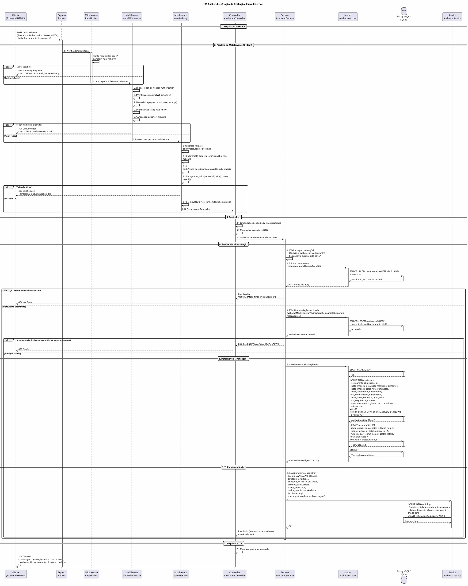
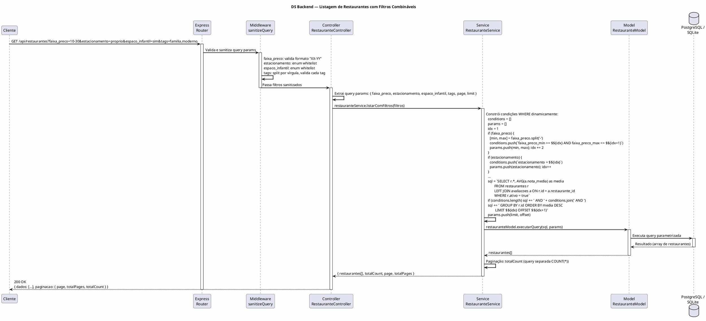
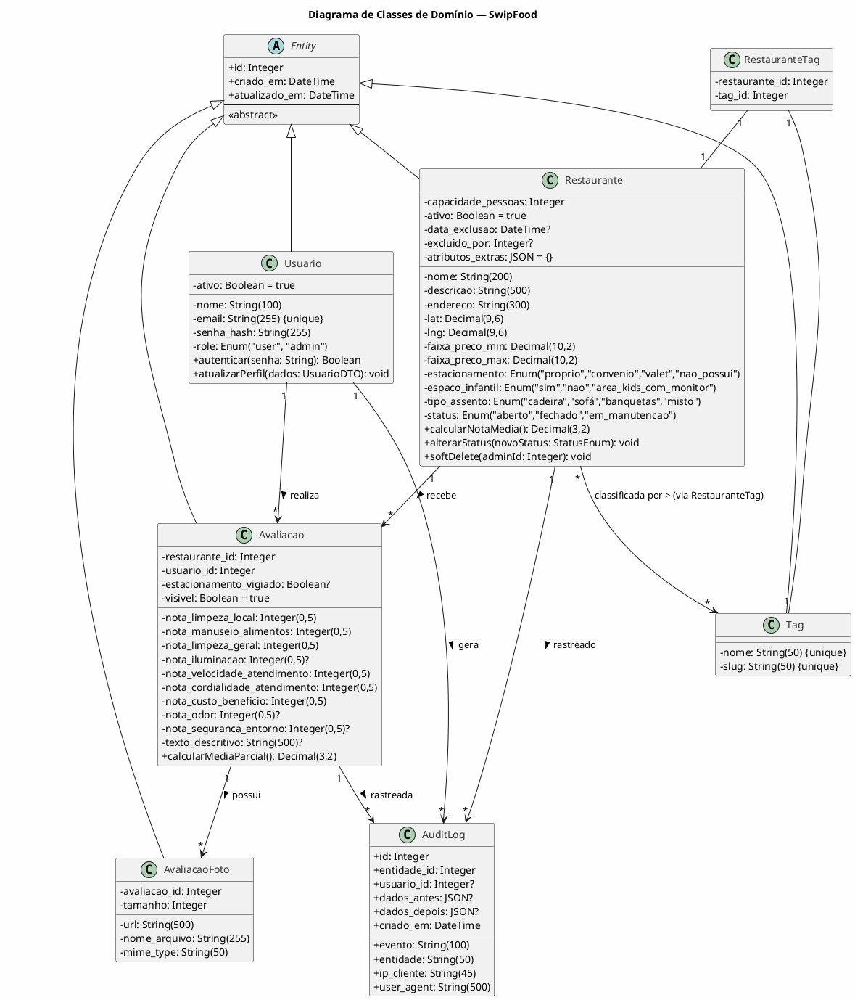
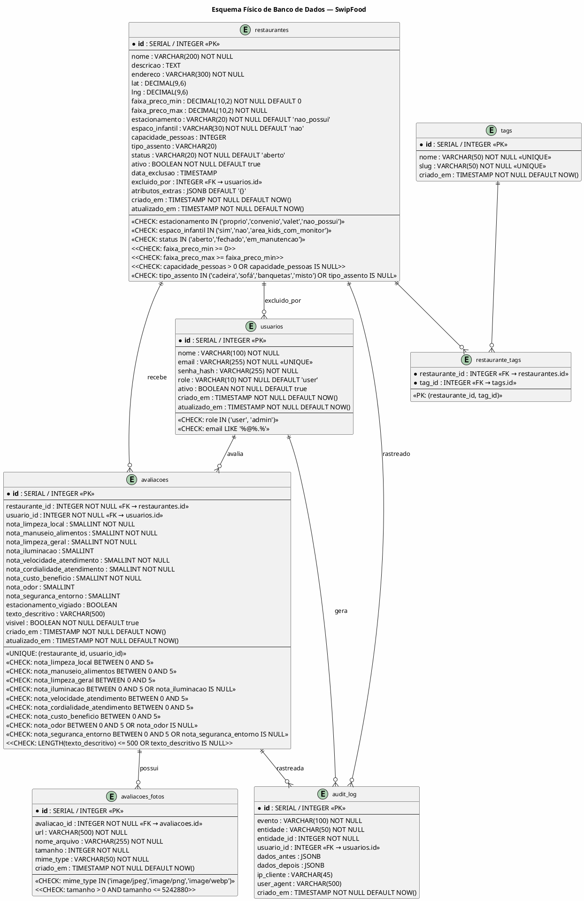

# Requisitos de Sistema — SwipFood

**Projeto:** SwipFood — Plataforma de Avaliação de Restaurantes  
**Normas de Referência:** OMG UML 2.5.1 · ISO/IEC/IEEE 29148:2018 · ISO/IEC 25010 / FURPS+  
**Stack Tecnológica:** Frontend HTML5 semântico, CSS3, JavaScript Vanilla/ES6+ · Backend Node.js com Express · SQLite/PostgreSQL com Prepared Statements  
**Versão do Documento:** 1.0  
**Data:** 10/09/2026  

---

## Índice

1. [Introdução e Legenda](#1-introdução-e-legenda)
2. [Requisitos Funcionais de Sistema (RSF)](#2-requisitos-funcionais-de-sistema-rsf)
3. [Requisitos Não Funcionais (RSNF) — FURPS+ / ISO 25010](#3-requisitos-não-funcionais-rsnf--furps--iso-25010)
4. [Diagramas de Sequência Backend — PlantUML](#4-diagramas-de-sequência-backend--plantuml)
5. [Diagrama Estrutural de Classes de Domínio com OCL](#5-diagrama-estrutural-de-classes-de-domínio-com-ocl)
6. [Dicionário Técnico de Dados — Esquema DDL](#6-dicionário-técnico-de-dados--esquema-ddl)
7. [Contratos de API RESTful](#7-contratos-de-api-restful)
8. [Matriz Bidirecional de Rastreabilidade Técnica](#8-matriz-bidirecional-de-rastreabilidade-técnica)

---

## 1. Introdução e Legenda

Este documento especifica os requisitos técnicos de sistema para o **SwipFood**, detalhando contratos de integração, segurança, persistência e runtime do backend Node.js/Express.

### Legenda de Prioridade e Tipo

| Código | Significado |
|--------|-------------|
| **F** | Requisito **Funcional** — Descreve comportamento observável do sistema |
| **NF** | Requisito **Não Funcional** — Descreve restrição de qualidade, performance ou arquitetura |
| **Alta** | Impacto crítico na operação; ausência compromete o sistema |
| **Média** | Importante para a experiência do usuário; ausência degrada significativamente |
| **Baixa** | Desejável; ausência não impede o funcionamento principal |

---

## 2. Requisitos Funcionais de Sistema (RSF)

### 2.1 Módulo de Avaliação da Qualidade da Comida

#### RSF-001: Sistema de Avaliação Numérica — Limpeza do Local e Manuseio dos Alimentos
| Campo | Detalhe |
|-------|---------|
| **ID** | RSF-001 |
| **Prioridade** | Alta |
| **Tipo** | F |
| **Requisito** | Permitir avaliação com nota de 0 a 5 para "Limpeza do Local" e "Manuseio dos Alimentos" |
| **Rota HTTP** | `POST /api/avaliacoes` |
| **Método** | POST |
| **Content-Type** | `application/json` |
| **Payload** | `{ "restaurante_id": integer, "nota_limpeza_local": integer(0-5), "nota_manuseio_alimentos": integer(0-5) }` |
| **Middlewares** | `authMiddleware` (verifica JWT), `sanitizeBody` (express-validator), `rateLimiter` (máx 10 req/min) |
| **Código de Status** | `201 Created` (sucesso), `400 Bad Request` (validação), `401 Unauthorized` (não autenticado), `429 Too Many Requests` (rate limit) |
| **Controller** | `avaliacaoController.criar()` |
| **Service** | `avaliacaoService.criar()` |
| **Query SQL** | `INSERT INTO avaliacoes (restaurante_id, usuario_id, nota_limpeza_local, nota_manuseio_alimentos, criado_em) VALUES ($1, $2, $3, $4, NOW())` |
| **Trilha de Auditoria** | `INSERT INTO audit_log (evento, entidade, entidade_id, usuario_id) VALUES ('AVALIACAO_CRIADA', 'avaliacao', ?, ?)` |

#### RSF-002: Sistema de Avaliação Numérica + Texto Descritivo Opcional
| Campo | Detalhe |
|-------|---------|
| **ID** | RSF-002 |
| **Prioridade** | Alta |
| **Tipo** | F |
| **Requisito** | Sistema de avaliação numérica (de 0 a 5) + campo opcional para texto descritivo |
| **Rota HTTP** | `POST /api/avaliacoes` (mesma rota, campos adicionais) |
| **Payload adicional** | `{ "texto_descritivo": string(≤500) \| null }` |
| **Sanitização** | Server-side: `express-validator` com `escape()` + `DOMPurify.sanitize()` |
| **Validação** | `body('texto_descritivo').optional().isLength({ max: 500 }).trim().escape()` |

#### RSF-003: Exibição de Faixa de Preço e Filtro
| Campo | Detalhe |
|-------|---------|
| **ID** | RSF-003 |
| **Prioridade** | Alta |
| **Tipo** | F |
| **Requisito** | Exibir faixa de preço (R$ 10–30, R$ 30–60, +60) e permitir filtro por essa faixa |
| **Rota HTTP** | `GET /api/restaurantes?faixa_preco=10-30` |
| **Query Params** | `faixa_preco`: string (valores válidos: `0-10`, `10-30`, `30-60`, `60+`) |
| **Múltiplas faixas** | `GET /api/restaurantes?faixa_preco=10-30,30-60` |
| **Controller** | `restauranteController.listar()` |
| **Query SQL** | `SELECT * FROM restaurantes WHERE ativo = true AND faixa_preco_min >= $1 AND faixa_preco_max <= $2` |

#### RSF-004: Campo "Odor do Ambiente/Comida" na Avaliação
| Campo | Detalhe |
|-------|---------|
| **ID** | RSF-004 |
| **Prioridade** | Baixa |
| **Tipo** | F |
| **Requisito** | Incluir no checklist de avaliação um atributo "Odor do ambiente/comida" (0 a 5) |
| **Rota HTTP** | `POST /api/avaliacoes` |
| **Payload adicional** | `{ "nota_odor": integer(0-5) \| null }` |

#### RSF-005: Upload de Fotos dos Pratos
| Campo | Detalhe |
|-------|---------|
| **ID** | RSF-005 |
| **Prioridade** | Média |
| **Tipo** | F |
| **Requisito** | Permitir upload de fotos dos pratos (com validação de formato e tamanho) |
| **Rota HTTP** | `POST /api/avaliacoes/:id/fotos` |
| **Content-Type** | `multipart/form-data` |
| **Middleware** | `multer` com config: `{ storage: memoryStorage, limits: { fileSize: 5*1024*1024 }, fileFilter: validaFormato }` |
| **Formatos aceitos** | JPEG (image/jpeg), PNG (image/png), WEBP (image/webp) |
| **Tamanho máximo** | 5 MB (5.242.880 bytes) |
| **Controller** | `avaliacaoController.uploadFotos()` |
| **Service** | `avaliacaoService.salvarFotos()` |
| **Query SQL** | `INSERT INTO avaliacoes_fotos (avaliacao_id, url, nome_arquivo, tamanho, mime_type) VALUES ($1, $2, $3, $4, $5)` |

#### RSF-006: Campo "Relação Custo-Benefício"
| Campo | Detalhe |
|-------|---------|
| **ID** | RSF-006 |
| **Prioridade** | Alta |
| **Tipo** | F |
| **Requisito** | Adicionar campo "Relação custo-benefício" (nota de 0 a 5) na avaliação |
| **Rota HTTP** | `POST /api/avaliacoes` |
| **Payload adicional** | `{ "nota_custo_beneficio": integer(0-5) }` (obrigatório) |

---

### 2.2 Módulo de Avaliação da Qualidade do Ambiente

#### RSF-007: Cadastro de Capacidade e Tipo de Assento
| Campo | Detalhe |
|-------|---------|
| **ID** | RSF-007 |
| **Prioridade** | Média |
| **Tipo** | F |
| **Requisito** | Cadastrar "Capacidade de pessoas" e "Tipo de assento" (cadeira, sofá, banquetas) |
| **Rota HTTP** | `POST /api/admin/restaurantes` (cadastro) · `PUT /api/admin/restaurantes/:id` (edição) |
| **Payload** | `{ "capacidade_pessoas": integer(>0), "tipo_assento": enum("cadeira","sofá","banquetas","misto") }` |
| **Controller** | `restauranteController.cadastrar()` / `restauranteController.editar()` |

#### RSF-008: Campos Binários Opcionais no Cadastro
| Campo | Detalhe |
|-------|---------|
| **ID** | RSF-008 |
| **Prioridade** | Baixa |
| **Tipo** | NF (meta-requisito de usabilidade do formulário) |
| **Requisito** | Adicionar opção binária (Sim/Não) no cadastro do restaurante para atributos como "Cozinha Transparente" |
| **Rota HTTP** | `POST /api/admin/restaurantes` |
| **Payload** | `{ "cozinha_transparente": boolean, "musica_ao_vivo": boolean }` |

#### RSF-009: Nota de "Limpeza Geral" nas Avaliações
| Campo | Detalhe |
|-------|---------|
| **ID** | RSF-009 |
| **Prioridade** | Alta |
| **Tipo** | F |
| **Requisito** | Nota específica de 0 a 5 para "Limpeza geral" nas avaliações |
| **Rota HTTP** | `POST /api/avaliacoes` |
| **Payload** | `{ "nota_limpeza_geral": integer(0-5) }` (obrigatório) |

#### RSF-010: Nota de "Iluminação" nas Avaliações
| Campo | Detalhe |
|-------|---------|
| **ID** | RSF-010 |
| **Prioridade** | Baixa |
| **Tipo** | F |
| **Requisito** | Checklist de avaliação com nota para "Iluminação" (de 0 a 5) |
| **Rota HTTP** | `POST /api/avaliacoes` |
| **Payload** | `{ "nota_iluminacao": integer(0-5) \| null }` |

#### RSF-011: Tags de Ambientação para Filtro
| Campo | Detalhe |
|-------|---------|
| **ID** | RSF-011 |
| **Prioridade** | Baixa |
| **Tipo** | F |
| **Requisito** | Campo de tags (ex.: "Rústico", "Moderno", "Família", "Romântico") para filtro |
| **Rota HTTP** | `GET /api/restaurantes?tags=rustico,familia` |
| **Persistência** | Tabela `restaurante_tags` (N:N) com JOIN na query |
| **Query SQL** | `SELECT r.* FROM restaurantes r INNER JOIN restaurante_tags rt ON r.id = rt.restaurante_id INNER JOIN tags t ON rt.tag_id = t.id WHERE t.nome = ANY($1)` |

#### RSF-012: Notas de "Velocidade" e "Cordialidade" do Atendimento
| Campo | Detalhe |
|-------|---------|
| **ID** | RSF-012 |
| **Prioridade** | Alta |
| **Tipo** | F |
| **Requisito** | Nota de 0 a 5 para "Velocidade" e "Cordialidade" (ou uma nota única de atendimento) |
| **Rota HTTP** | `POST /api/avaliacoes` |
| **Payload** | `{ "nota_velocidade_atendimento": integer(0-5), "nota_cordialidade_atendimento": integer(0-5) }` |

#### RSF-013: Integração com API de Mapas
| Campo | Detalhe |
|-------|---------|
| **ID** | RSF-013 |
| **Prioridade** | Alta |
| **Tipo** | F |
| **Requisito** | Integração com API de mapas (Google/OpenStreetMap) para exibir distância e endereço |
| **Rota HTTP** | `GET /api/restaurantes/:id/detalhes` (resposta inclui `endereco_completo`, `lat`, `lng`, `distancia_km`) |
| **Serviço Externo** | Google Maps Geocoding API ou OpenStreetMap Nominatim |
| **Variável de Ambiente** | `GOOGLE_MAPS_API_KEY` ou `USE_OSM=true` |
| **Middleware** | Cache em memória (TTL 1h) para consultas de geocoding |
| **Cálculo de Distância** | Fórmule de Haversine implementada no service: `2 * R * arcsin(sqrt(sin²(Δφ/2) + cos(φ1)*cos(φ2)*sin²(Δλ/2)))` |

#### RSF-014: Cadastrar Opção de Estacionamento
| Campo | Detalhe |
|-------|---------|
| **ID** | RSF-014 |
| **Prioridade** | Alta |
| **Tipo** | F |
| **Requisito** | Cadastrar opções: "Próprio", "Convênio", "Valet", "Não possui" |
| **Rota HTTP** | `POST /api/admin/restaurantes` |
| **Payload** | `{ "estacionamento": enum("proprio","convenio","valet","nao_possui") }` |
| **CHECK constraint** | `estacionamento IN ('proprio', 'convenio', 'valet', 'nao_possui')` |

#### RSF-015: Cadastrar Opção de Espaço Infantil
| Campo | Detalhe |
|-------|---------|
| **ID** | RSF-015 |
| **Prioridade** | Alta |
| **Tipo** | F |
| **Requisito** | Cadastrar: "Sim", "Não" ou "Área kids com monitor" |
| **Rota HTTP** | `POST /api/admin/restaurantes` |
| **Payload** | `{ "espaco_infantil": enum("sim","nao","area_kids_com_monitor") }` |
| **CHECK constraint** | `espaco_infantil IN ('sim', 'nao', 'area_kids_com_monitor')` |

#### RSF-016: Nota de "Segurança do Entorno" e "Estacionamento Vigiado"
| Campo | Detalhe |
|-------|---------|
| **ID** | RSF-016 |
| **Prioridade** | Média |
| **Tipo** | F |
| **Requisito** | Adicionar nota de 0 a 5 para "Segurança do entorno" + opção de "Estacionamento vigiado" |
| **Rota HTTP** | `POST /api/avaliacoes` |
| **Payload** | `{ "nota_seguranca_entorno": integer(0-5) \| null, "estacionamento_vigiado": boolean \| null }` |

#### RSF-017: Atributos Extras Opcionais
| Campo | Detalhe |
|-------|---------|
| **ID** | RSF-017 |
| **Prioridade** | Baixa |
| **Tipo** | F |
| **Requisito** | Os demais atributos (odor, iluminação, cozinha transparente, etc.) podem vir como campos extras, sem obrigatoriedade |
| **Implementação** | Campo JSON no banco: `atributos_extras JSONB DEFAULT '{}'` |

---

### 2.3 Módulo de Usuários e Autenticação

#### RSF-018: Cadastro de Usuário
| Campo | Detalhe |
|-------|---------|
| **ID** | RSF-018 |
| **Rota HTTP** | `POST /api/auth/registro` |
| **Payload** | `{ "nome": string(2-100), "email": string(email), "senha": string(≥8, 1 maiúscula, 1 número, 1 especial) }` |
| **Middlewares** | `sanitizeBody`, `rateLimiter` (3 req/min) |
| **Controller** | `authController.registrar()` |
| **Senha** | Hash com bcrypt, salt rounds = 12 |

#### RSF-019: Login com JWT
| Campo | Detalhe |
|-------|---------|
| **ID** | RSF-019 |
| **Rota HTTP** | `POST /api/auth/login` |
| **Payload** | `{ "email": string, "senha": string }` |
| **Resposta** | `200 OK { token: string, usuario: { id, nome, email, role } }` |
| **Cookie** | `Set-Cookie: token=JWT; HttpOnly; Secure; SameSite=Strict; Path=/; Max-Age=86400` |
| **JWT Payload** | `{ sub: usuario_id, role: "user"|"admin", iat, exp: "24h" }` |

#### RSF-020: Gerenciamento de Perfil
| Campo | Detalhe |
|-------|---------|
| **ID** | RSF-020 |
| **Rota HTTP** | `GET /api/usuarios/perfil` · `PUT /api/usuarios/perfil` |
| **Controller** | `usuarioController.obterPerfil()` / `usuarioController.atualizarPerfil()` |

#### RSF-021: Logout
| Campo | Detalhe |
|-------|---------|
| **ID** | RSF-021 |
| **Rota HTTP** | `POST /api/auth/logout` |
| **Efeito** | Clear cookie `token`; registro na audit_log |

---

### 2.4 Módulo Administrativo

#### RSF-022: Gerenciamento Completo de Restaurantes (CRUD)
| Campo | Detalhe |
|-------|---------|
| **ID** | RSF-022 |
| **Rotas HTTP** | `GET /api/admin/restaurantes` · `POST /api/admin/restaurantes` · `PUT /api/admin/restaurantes/:id` · `DELETE /api/admin/restaurantes/:id` |
| **Middlewares** | `authMiddleware` + `adminMiddleware` |
| **Soft Delete** | `UPDATE restaurantes SET ativo = false, data_exclusao = NOW()` |

#### RSF-023: Alteração de Status de Atendimento
| Campo | Detalhe |
|-------|---------|
| **ID** | RSF-023 |
| **Rota HTTP** | `PATCH /api/admin/restaurantes/:id/status` |
| **Payload** | `{ "status": "aberto" | "fechado" | "em_manutencao" }` |
| **Transições válidas** | `aberto → fechado`, `aberto → em_manutencao`, `fechado → aberto`, `em_manutencao → aberto` |
| **Trilha de Auditoria** | Sempre registrada com `evento: 'STATUS_ALTERADO'` |

#### RSF-024: Moderação de Avaliações
| Campo | Detalhe |
|-------|---------|
| **ID** | RSF-024 |
| **Rota HTTP** | `GET /api/admin/avaliacoes` · `PATCH /api/admin/avaliacoes/:id/visibilidade` |
| **Payload** | `{ "visivel": boolean }` |

#### RSF-025: Gerenciamento de Usuários
| Campo | Detalhe |
|-------|---------|
| **ID** | RSF-025 |
| **Rota HTTP** | `GET /api/admin/usuarios` · `PATCH /api/admin/usuarios/:id/role` |
| **Payload** | `{ "role": "user" | "admin" }` |

#### RSF-026: Dashboard e Relatórios
| Campo | Detalhe |
|-------|---------|
| **ID** | RSF-026 |
| **Rota HTTP** | `GET /api/admin/dashboard` · `GET /api/admin/relatorios/avaliacoes?periodo=30d` |

---

## 3. Requisitos Não Funcionais (RSNF) — FURPS+ / ISO 25010

### 3.1 Taxonomia FURPS+

| ID | Categoria | Requisito | Prioridade | Detalhes Técnicos |
|----|-----------|-----------|------------|-------------------|
| RSNF-001 | **F**unctionality / Segurança | Criptografia de senhas com algoritmo seguro | Alta | bcrypt com salt rounds = 12 (ou argon2id com memória=65536KB, iteracões=3, paralelismo=4). Nunca armazenar senhas em texto plano. Variável `BCRYPT_ROUNDS` configurável via `.env`. |
| RSNF-002 | **F**unctionality / Segurança | Autenticação stateless via JWT | Alta | Token gerado com `jsonwebtoken` (HS256 ou RS256). Payload: `{ sub, role, iat, exp }`. Armazenado em cookie HTTP-Only (`HttpOnly; Secure; SameSite=Strict`). Token de refresh opcional para renovação silenciosa. Secret via variável `JWT_SECRET` (≥256 bits). |
| RSNF-003 | **F**unctionality / Segurança | Sanitização contra XSS | Alta | Server-side: `express-validator` com `escape()` em todos os campos string. `DOMPurify.sanitize()` para conteúdo HTML. Client-side: `textContent` em vez de `innerHTML`. CSP header: `Content-Security-Policy: default-src 'self'; script-src 'self'` |
| RSNF-004 | **F**unctionality / Segurança | Prevenção de SQL Injection | Alta | Exclusivamente Prepared Statements (`$1, $2, ...` no PostgreSQL / `?` no SQLite via `better-sqlite3`). Nunca concatenar strings em queries. ORM/Query Builder: `knex.js` ou `prisma` como alternativa. |
| RSNF-005 | **F**unctionality / Segurança | Rate Limiting | Alta | `express-rate-limit`: geral (100 req/15min), login (5 req/15min), avaliação (10 req/min). Headers `X-RateLimit-*` na resposta. |
| RSNF-006 | **F**unctionality / Segurança | CORS configurado | Média | `cors({ origin: FRONTEND_URL, credentials: true, methods: ['GET','POST','PUT','PATCH','DELETE'] })` |
| RSNF-007 | **U**sability | Formulário com no máximo 8 campos obrigatórios | Média | Campos obrigatórios: nota_limpeza_local, nota_manuseio_alimentos, nota_limpeza_geral, nota_velocidade_atendimento, nota_cordialidade_atendimento, nota_custo_beneficio, restaurante_id = 7 campos. Campos opcionais: nota_odor, nota_iluminacao, nota_seguranca_entorno, texto_descritivo, fotos. |
| RSNF-008 | **R**eliability | Disponibilidade em horário de pico | Alta | SLA ≥ 99.5% durante 11h–15h e 19h–23h. Health check: `GET /api/health` retorna 200 OK. Monitoramento com `prom-client` (métricas Prometheus). Graceful shutdown com `process.on('SIGTERM')`. |
| RSNF-009 | **R**eliability | Armazenamento de histórico de avaliações | Alta | Persistência permanente de todas as avaliações (soft delete apenas). Médias calculadas via trigger ou query materializada. Índices para performance: `CREATE INDEX idx_avaliacoes_restaurante ON avaliacoes(restaurante_id)`. |
| RSNF-010 | **P**erformance | Concorrência de I/O não bloqueante | Alta | Node.js Event Loop: não bloquear com operações síncronas pesadas. `fs.readFile` → `fs.promises.readFile`. `crypto.pbkdf2` → `crypto.pbkdf2` (async). Pool de conexões: `pg.Pool` com `max: 20`, `idleTimeoutMillis: 30000`. |
| RSNF-011 | **P**erformance | Tempo de resposta API | Alta | P95 < 200ms para endpoints de leitura. P95 < 500ms para endpoints de escrita. Cache Redis/Memory para queries frequentes (TTL 5min). |
| RSNF-012 | **P**erformance | Compressão de respostas HTTP | Média | `compression()` middleware: gzip/deflate para respostas > 1KB. |
| RSNF-013 | **S**upportability / Arquitetura | Filtros combináveis | Alta | Query builder dinâmico: `WHERE` condicional para cada filtro. Todos os filtros (preço, estacionamento, espaço infantil, tags) combináveis com AND lógico. |
| RSNF-014 | **S**upportability / Arquitetura | Estrutura de pastas convencional | Média | `src/controllers/`, `src/services/`, `src/models/`, `src/middlewares/`, `src/routes/`, `src/config/`, `src/utils/`, `src/validators/` |
| RSNF-015 | **S**upportability / Arquitetura | Tratamento de erros centralizado | Média | Middleware `errorHandler` no Express. Errors logados com `winston` (nível: `error`). Resposta padronizada: `{ erro: { codigo, mensagem, detalhes? } }`. |

### 3.2 Detalhamento de Segurança

#### 3.2.1 Criptografia de Senhas

| Aspecto | Especificação |
|---------|---------------|
| **Algoritmo** | bcrypt (recomendado) ou argon2id |
| **Salt Rounds (bcrypt)** | 12 (configurável via `BCRYPT_ROUNDS`) |
| **Argon2id Parâmetros** | memória: 65536 KB, iterações: 3, paralelismo: 4 |
| **Biblioteca** | `bcryptjs` (pure JS) ou `argon2` (native bindings) |
| **Fluxo Cadastro** | 1. Receber senha em texto plano; 2. Gerar salt aleatório; 3. Computar hash = await bcrypt.hash(senha, saltRounds); 4. Armazenar hash no banco |
| **Fluxo Login** | 1. Receber email + senha; 2. Buscar hash do banco; 3. Comparar = await bcrypt.compare(senha, hash); 4. Se true → autenticar; Se false → rejeitar |
| **Nunca** | Armazenar senhas em texto plano; usar MD5/SHA1/SHA256 puro; reutilizar salt entre usuários |

#### 3.2.2 Autenticação e Autorização via JWT

| Aspecto | Especificação |
|---------|---------------|
| **Algoritmo de Assinatura** | HS256 (HMAC-SHA256) para simpler; RS256 (RSA-SHA256) para produção distribuída |
| **Secret / Private Key** | Variável de ambiente `JWT_SECRET` (≥32 bytes = 256 bits) ou `JWT_PRIVATE_KEY` (arquivo PEM) |
| **Payload JWT** | `{ sub: usuario_id, role: "user" | "admin", iat: issued_at, exp: expiration }` |
| **Tempo de Expiração** | Access token: 24h; Refresh token (opcional): 7d |
| **Armazenamento** | Cookie HTTP-Only: `Set-Cookie: token=<JWT>; HttpOnly; Secure; SameSite=Strict; Path=/; Max-Age=86400` |
| **Cabeçalho Alternativo** | `Authorization: Bearer <JWT>` (para APIs que não usam cookies) |
| **Middlewares Express** | `authMiddleware`: verifica token, decodifica payload, anexa `req.usuario`; `adminMiddleware`: verifica `req.usuario.role === 'admin'` |
| **Invalidação** | Logout: deleta cookie. Para invalidação antecipada: blacklist em Redis com TTL = tempo restante do token |

#### 3.2.3 Sanitização e Prevenção de Injeção

| Vetor | Mecanismo de Defesa | Implementação |
|-------|---------------------|---------------|
| **XSS (Cross-Site Scripting)** | Sanitização server-side | `express-validator` com `escape()` em todos os campos string de input; `DOMPurify.sanitize()` para conteúdo que aceita HTML |
| **XSS** | Sanitização client-side | Uso de `textContent` em vez de `innerHTML`; CSP header restritivo |
| **SQL Injection** | Prepared Statements | Todas as queries usam parâmetros posicionais (`$1, $2` no PG / `?` no SQLite). Nunca concatenação de strings SQL |
| **SQL Injection** | Query Builder | `knex.js` com `.where('coluna', valor)` (parametrizado automaticamente) |
| **NoSQL Injection** | Validação de tipos | `express-validator` com `.isInt()`, `.isEmail()`, `.isLength()` — rejeita entrada não esperada |
| **Path Traversal** | Validação de nomes de arquivo | `path.extname()` whitelist; `multer` com `filename` gerado (UUID) |

#### 3.2.4 Concorrência de I/O e Event Loop

| Aspecto | Especificação |
|---------|---------------|
| **Event Loop** | Node.js roda em thread única; operações síncronas pesadas bloqueiam todas as requisições |
| **Regra** | Nunca usar `fs.readFileSync`, `crypto.pbkdf2Sync`, loops `for` com operações assíncronas sequenciais |
| **Alternativa** | Usar `fs.promises.*`, `crypto.pbkdf2` (async), `Promise.all()` para I/O paralelo |
| **Pool de Conexões** | `pg.Pool({ max: 20, idleTimeoutMillis: 30000, connectionTimeoutMillis: 5000 })` |
| **SQLite** | `better-sqlite3` é síncrono (bloqueante) — usar apenas em dev. Produção: PostgreSQL com pool async |
| **Monitoramento** | `prom-client` para métricas: `event_loop_lag`, `active_handles`, `heap_used` |
| **Circuit Breaker** | `opossum` para chamadas a APIs externas (mapas): timeout 5s, 5 falhas → circuito aberto por 30s |

---

## 4. Diagramas de Sequência Backend — PlantUML

### 4.1 DS — Fluxo Interno: Rota Express → Middlewares → Controller → Service/Model → Banco → Auditoria

#### 4.1.1 Fluxo de Criação de Avaliação (Escrita)



#### 4.1.2 Fluxo de Leitura com Filtros Combináveis



---

## 5. Diagrama Estrutural de Classes de Domínio com OCL

### 5.1 Diagrama de Classes de Domínio



### 5.2 Invariantes OCL (Object Constraint Language)

As invariantes OCL garantem a integridade das regras de negócio e transições de estado.

```ocl
-- ==========================================================
-- INVARIANTES DE CLASSE
-- ==========================================================

-- Restaurante: nome obrigatório e único
context Restaurante
  inv nomeObrigatorio: self.nome <> null and self.nome.length() >= 2
  inv nomeUnico: -- verificado via constraint UNIQUE no banco

-- Restaurante: faixa de preço coerente
context Restaurante
  inv faixaPrecoCoerente: self.faixa_preco_min >= 0
                         and self.faixa_preco_max >= self.faixa_preco_min

-- Restaurante: capacidade positiva
context Restaurante
  inv capacidadePositiva: self.capacidade_pessoas > 0 or self.capacidade_pessoas = null

-- Restaurante: status válido
context Restaurante
  inv statusValido: self.status = 'aberto'
                   or self.status = 'fechado'
                   or self.status = 'em_manutencao'

-- Restaurante: exclusão lógica com dados obrigatórios
context Restaurante
  inv exclusaoLogica: (self.ativo = false) implies
                      (self.data_exclusao <> null and self.excluido_por <> null)

-- Avaliação: todas as notas obrigatórias no intervalo [0,5]
context Avaliacao
  inv notasObrigatorias: self.nota_limpeza_local >= 0
                        and self.nota_limpeza_local <= 5
                        and self.nota_manuseio_alimentos >= 0
                        and self.nota_manuseio_alimentos <= 5
                        and self.nota_limpeza_geral >= 0
                        and self.nota_limpeza_geral <= 5
                        and self.nota_velocidade_atendimento >= 0
                        and self.nota_velocidade_atendimento <= 5
                        and self.nota_cordialidade_atendimento >= 0
                        and self.nota_cordialidade_atendimento <= 5
                        and self.nota_custo_beneficio >= 0
                        and self.nota_custo_beneficio <= 5

-- Avaliação: notas opcionais no intervalo [0,5] ou null
context Avaliacao
  inv notasOpcionais: (self.nota_odor = null
                       or (self.nota_odor >= 0 and self.nota_odor <= 5))
                      and (self.nota_iluminacao = null
                           or (self.nota_iluminacao >= 0 and self.nota_iluminacao <= 5))
                      and (self.nota_seguranca_entorno = null
                           or (self.nota_seguranca_entorno >= 0 and self.nota_seguranca_entorno <= 5))

-- Avaliação: texto descritivo com limite de tamanho
context Avaliacao
  inv textoLimite: self.texto_descritivo = null
                   or self.texto_descritivo.length() <= 500

-- Avaliação: uma avaliação por usuário por restaurante (regra de negócio)
context Avaliacao
  inv avaliacaoUnica: -- implementada via constraint UNIQUE(restaurante_id, usuario_id) no banco

-- AuditLog: campos obrigatórios
context AuditLog
  inv camposObrigatorios: self.evento <> null
                         and self.entidade <> null
                         and self.entidade_id <> null
                         and self.criado_em <> null

-- ==========================================================
-- INVARIANTES DE TRANSIÇÃO DE STATUS (Restaurante)
-- ==========================================================

-- Transições válidas de status:
--   aberto → fechado          (VÁLIDA)
--   aberto → em_manutencao    (VÁLIDA)
--   fechado → aberto          (VÁLIDA)
--   em_manutencao → aberto    (VÁLIDA)
--   fechado → em_manutencao   (INVÁLIDA — precisa reabrir primeiro)
--   em_manutencao → fechado   (INVÁLIDA — precisa reabrir primeiro)

context Restaurante::alterarStatus(novoStatus: StatusEnum)
  pre transicaoValida: self.status <> novoStatus
  pre transicaoPermitida:
    (self.status = 'aberto' and novoStatus = 'fechado')
    or (self.status = 'aberto' and novoStatus = 'em_manutencao')
    or (self.status = 'fechado' and novoStatus = 'aberto')
    or (self.status = 'em_manutencao' and novoStatus = 'aberto')
  post statusAtualizado: self.status = novoStatus

-- ==========================================================
-- INVARIANTES DE DOMÍNIO
-- ==========================================================

-- Usuário: email com formato válido
context Usuario
  inv emailValido: self.email.matches('[a-zA-Z0-9._%+-]+@[a-zA-Z0-9.-]+\\.[a-zA-Z]{2,}$')

-- Usuário: role válida
context Usuario
  inv roleValida: self.role = 'user' or self.role = 'admin'

-- AvaliaçãoFoto: formato e tamanho
context AvaliacaoFoto
  inv formatoValido: self.mime_type = 'image/jpeg'
                    or self.mime_type = 'image/png'
                    or self.mime_type = 'image/webp'
  inv tamanhoValido: self.tamanho > 0 and self.tamanho <= 5242880 -- 5MB

-- RestauranteTag: integridade referencial
context RestauranteTag
  inv integridadeReferencial: self.restaurante_id <> null and self.tag_id <> null
```

---

## 6. Dicionário Técnico de Dados — Esquema DDL

### 6.1 Diagrama de Esquema Físico



### 6.2 Script DDL Completo (PostgreSQL)

```sql
-- ============================================================
-- SwipFood — Esquema DDL Completo (PostgreSQL 15+)
-- ============================================================

-- Extensões necessárias
CREATE EXTENSION IF NOT EXISTS "pgcrypto";  -- Para gen_random_uuid() se necessário

-- ============================================================
-- TABELA: usuarios
-- ============================================================
CREATE TABLE usuarios (
    id              SERIAL PRIMARY KEY,
    nome            VARCHAR(100)  NOT NULL,
    email           VARCHAR(255)  NOT NULL UNIQUE,
    senha_hash      VARCHAR(255)  NOT NULL,
    role            VARCHAR(10)   NOT NULL DEFAULT 'user'
                    CHECK (role IN ('user', 'admin')),
    ativo           BOOLEAN       NOT NULL DEFAULT true,
    criado_em       TIMESTAMP     NOT NULL DEFAULT NOW(),
    atualizado_em   TIMESTAMP     NOT NULL DEFAULT NOW()
);

-- Índices para usuarios
CREATE INDEX idx_usuarios_email ON usuarios(email);
CREATE INDEX idx_usuarios_role  ON usuarios(role);

-- ============================================================
-- TABELA: restaurantes
-- ============================================================
CREATE TABLE restaurantes (
    id                    SERIAL PRIMARY KEY,
    nome                  VARCHAR(200)  NOT NULL,
    descricao             TEXT,
    endereco              VARCHAR(300)  NOT NULL,
    lat                   DECIMAL(9,6),
    lng                   DECIMAL(9,6),
    faixa_preco_min       DECIMAL(10,2) NOT NULL DEFAULT 0
                          CHECK (faixa_preco_min >= 0),
    faixa_preco_max       DECIMAL(10,2) NOT NULL
                          CHECK (faixa_preco_max >= faixa_preco_min),
    estacionamento        VARCHAR(20)   NOT NULL DEFAULT 'nao_possui'
                          CHECK (estacionamento IN ('proprio','convenio','valet','nao_possui')),
    espaco_infantil       VARCHAR(30)   NOT NULL DEFAULT 'nao'
                          CHECK (espaco_infantil IN ('sim','nao','area_kids_com_monitor')),
    capacidade_pessoas    INTEGER
                          CHECK (capacidade_pessoas > 0 OR capacidade_pessoas IS NULL),
    tipo_assento          VARCHAR(20)
                          CHECK (tipo_assento IN ('cadeira','sofá','banquetas','misto') OR tipo_assento IS NULL),
    status                VARCHAR(20)   NOT NULL DEFAULT 'aberto'
                          CHECK (status IN ('aberto','fechado','em_manutencao')),
    ativo                 BOOLEAN       NOT NULL DEFAULT true,
    data_exclusao         TIMESTAMP     NULL,
    excluido_por          INTEGER       NULL
                          REFERENCES usuarios(id) ON DELETE SET NULL,
    atributos_extras      JSONB         DEFAULT '{}',
    criado_em             TIMESTAMP     NOT NULL DEFAULT NOW(),
    atualizado_em         TIMESTAMP     NOT NULL DEFAULT NOW()
);

-- Índices para restaurantes
CREATE INDEX idx_restaurantes_status     ON restaurantes(status);
CREATE INDEX idx_restaurantes_ativo      ON restaurantes(ativo);
CREATE INDEX idx_restaurantes_preco      ON restaurantes(faixa_preco_min, faixa_preco_max);
CREATE INDEX idx_restaurantes_estacion   ON restaurantes(estacionamento);
CREATE INDEX idx_restaurantes_espaco     ON restaurantes(espaco_infantil);
CREATE INDEX idx_restaurantes_lat_lng    ON restaurantes(lat, lng);
CREATE INDEX idx_restaurantes_nome       ON restaurantes(nome);

-- ============================================================
-- TABELA: avaliacoes
-- ============================================================
CREATE TABLE avaliacoes (
    id                              SERIAL PRIMARY KEY,
    restaurante_id                  INTEGER     NOT NULL
                                    REFERENCES restaurantes(id) ON DELETE CASCADE,
    usuario_id                      INTEGER     NOT NULL
                                    REFERENCES usuarios(id) ON DELETE CASCADE,
    nota_limpeza_local              SMALLINT    NOT NULL
                                    CHECK (nota_limpeza_local BETWEEN 0 AND 5),
    nota_manuseio_alimentos         SMALLINT    NOT NULL
                                    CHECK (nota_manuseio_alimentos BETWEEN 0 AND 5),
    nota_limpeza_geral              SMALLINT    NOT NULL
                                    CHECK (nota_limpeza_geral BETWEEN 0 AND 5),
    nota_iluminacao                 SMALLINT    NULL
                                    CHECK (nota_iluminacao BETWEEN 0 AND 5 OR nota_iluminacao IS NULL),
    nota_velocidade_atendimento     SMALLINT    NOT NULL
                                    CHECK (nota_velocidade_atendimento BETWEEN 0 AND 5),
    nota_cordialidade_atendimento   SMALLINT    NOT NULL
                                    CHECK (nota_cordialidade_atendimento BETWEEN 0 AND 5),
    nota_custo_beneficio            SMALLINT    NOT NULL
                                    CHECK (nota_custo_beneficio BETWEEN 0 AND 5),
    nota_odor                       SMALLINT    NULL
                                    CHECK (nota_odor BETWEEN 0 AND 5 OR nota_odor IS NULL),
    nota_seguranca_entorno          SMALLINT    NULL
                                    CHECK (nota_seguranca_entorno BETWEEN 0 AND 5 OR nota_seguranca_entorno IS NULL),
    estacionamento_vigiado          BOOLEAN     NULL,
    texto_descritivo                VARCHAR(500) NULL
                                    CHECK (texto_descritivo IS NULL OR LENGTH(texto_descritivo) <= 500),
    visivel                         BOOLEAN     NOT NULL DEFAULT true,
    criado_em                       TIMESTAMP   NOT NULL DEFAULT NOW(),
    atualizado_em                   TIMESTAMP   NOT NULL DEFAULT NOW(),

    -- Constraint: uma avaliação por usuário por restaurante
    UNIQUE (restaurante_id, usuario_id)
);

-- Índices para avaliacoes
CREATE INDEX idx_avaliacoes_restaurante  ON avaliacoes(restaurante_id);
CREATE INDEX idx_avaliacoes_usuario      ON avaliacoes(usuario_id);
CREATE INDEX idx_avaliacoes_criado       ON avaliacoes(criado_em);
CREATE INDEX idx_avaliacoes_visivel      ON avaliacoes(visivel);
CREATE INDEX idx_avaliacoes_media        ON avaliacoes(restaurante_id, usuario_id);

-- ============================================================
-- TABELA: avaliacoes_fotos
-- ============================================================
CREATE TABLE avaliacoes_fotos (
    id              SERIAL PRIMARY KEY,
    avaliacao_id    INTEGER     NOT NULL
                    REFERENCES avaliacoes(id) ON DELETE CASCADE,
    url             VARCHAR(500) NOT NULL,
    nome_arquivo    VARCHAR(255) NOT NULL,
    tamanho         INTEGER     NOT NULL
                    CHECK (tamanho > 0 AND tamanho <= 5242880),
    mime_type       VARCHAR(50) NOT NULL
                    CHECK (mime_type IN ('image/jpeg','image/png','image/webp')),
    criado_em       TIMESTAMP   NOT NULL DEFAULT NOW()
);

-- Índices para avaliacoes_fotos
CREATE INDEX idx_fotos_avaliacao ON avaliacoes_fotos(avaliacao_id);

-- ============================================================
-- TABELA: tags
-- ============================================================
CREATE TABLE tags (
    id          SERIAL PRIMARY KEY,
    nome        VARCHAR(50)  NOT NULL UNIQUE,
    slug        VARCHAR(50)  NOT NULL UNIQUE,
    criado_em   TIMESTAMP    NOT NULL DEFAULT NOW()
);

-- Dados iniciais de tags
INSERT INTO tags (nome, slug) VALUES
  ('Rústico', 'rustico'),
  ('Moderno', 'moderno'),
  ('Família', 'familia'),
  ('Romântico', 'romantico'),
  ('Tradicional', 'tradicional'),
  ('Gourmet', 'gourmet');

-- ============================================================
-- TABELA: restaurante_tags (relação N:N)
-- ============================================================
CREATE TABLE restaurante_tags (
    restaurante_id  INTEGER NOT NULL
                    REFERENCES restaurantes(id) ON DELETE CASCADE,
    tag_id          INTEGER NOT NULL
                    REFERENCES tags(id) ON DELETE CASCADE,
    PRIMARY KEY (restaurante_id, tag_id)
);

-- Índices para restaurante_tags
CREATE INDEX idx_rt_restaurante ON restaurante_tags(restaurante_id);
CREATE INDEX idx_rt_tag         ON restaurante_tags(tag_id);

-- ============================================================
-- TABELA: audit_log
-- ============================================================
CREATE TABLE audit_log (
    id              SERIAL PRIMARY KEY,
    evento          VARCHAR(100) NOT NULL,
    entidade        VARCHAR(50)  NOT NULL,
    entidade_id     INTEGER      NOT NULL,
    usuario_id      INTEGER      NULL
                    REFERENCES usuarios(id) ON DELETE SET NULL,
    dados_antes     JSONB        NULL,
    dados_depois    JSONB        NULL,
    ip_cliente      VARCHAR(45)  NULL,
    user_agent      VARCHAR(500) NULL,
    criado_em       TIMESTAMP    NOT NULL DEFAULT NOW()
);

-- Índices para audit_log
CREATE INDEX idx_audit_evento    ON audit_log(evento);
CREATE INDEX idx_audit_entidade  ON audit_log(entidade, entidade_id);
CREATE INDEX idx_audit_usuario   ON audit_log(usuario_id);
CREATE INDEX idx_audit_data      ON audit_log(criado_em);

-- ============================================================
-- FUNÇÃO E TRIGGER: Atualizar nota_media do restaurante
-- ============================================================
CREATE OR REPLACE FUNCTION fn_atualizar_nota_media()
RETURNS TRIGGER AS $$
BEGIN
    UPDATE restaurantes
    SET
        media_nota_limpeza = sub.media_limpeza,
        media_nota_sabor = sub.media_sabor,
        media_nota_ambiente = sub.media_ambiente,
        media_nota_atendimento = sub.media_atendimento,
        media_nota_custobeneficio = sub.media_cb,
        nota_media_geral = sub.media_geral,
        total_avaliacoes = sub.total,
        atualizado_em = NOW()
    FROM (
        SELECT
            restaurante_id,
            ROUND(AVG(nota_limpeza_local)::numeric, 2) AS media_limpeza,
            ROUND(AVG(nota_manuseio_alimentos)::numeric, 2) AS media_sabor,
            ROUND(AVG(
                (nota_limpeza_geral + COALESCE(nota_iluminacao, nota_limpeza_geral)) /
                CASE WHEN nota_iluminacao IS NOT NULL THEN 2.0 ELSE 1.0 END
            )::numeric, 2) AS media_ambiente,
            ROUND(AVG(
                (nota_velocidade_atendimento + nota_cordialidade_atendimento) / 2.0
            )::numeric, 2) AS media_atendimento,
            ROUND(AVG(nota_custo_beneficio)::numeric, 2) AS media_cb,
            ROUND(AVG(
                (nota_limpeza_local + nota_manuseio_alimentos + nota_limpeza_geral +
                 nota_velocidade_atendimento + nota_cordialidade_atendimento +
                 nota_custo_beneficio) / 6.0
            )::numeric, 2) AS media_geral,
            COUNT(*) AS total
        FROM avaliacoes
        WHERE visivel = true
        GROUP BY restaurante_id
    ) AS sub
    WHERE restaurantes.id = sub.restaurante_id;

    RETURN COALESCE(NEW, OLD);
END;
$$ LANGUAGE plpgsql;

-- Trigger para INSERT
CREATE TRIGGER trg_avaliacao_after_insert
AFTER INSERT ON avaliacoes
FOR EACH ROW
EXECUTE FUNCTION fn_atualizar_nota_media();

-- Trigger para UPDATE (visibilidade)
CREATE TRIGGER trg_avaliacao_after_update
AFTER UPDATE OF visivel ON avaliacoes
FOR EACH ROW
EXECUTE FUNCTION fn_atualizar_nota_media();

-- Trigger para DELETE
CREATE TRIGGER trg_avaliacao_after_delete
AFTER DELETE ON avaliacoes
FOR EACH ROW
EXECUTE FUNCTION fn_atualizar_nota_media();

-- ============================================================
-- COLUNAS DERIVADAS (adicionar à tabela restaurantes)
-- ============================================================
ALTER TABLE restaurantes ADD COLUMN media_nota_limpeza       DECIMAL(3,2) DEFAULT 0;
ALTER TABLE restaurantes ADD COLUMN media_nota_sabor         DECIMAL(3,2) DEFAULT 0;
ALTER TABLE restaurantes ADD COLUMN media_nota_ambiente      DECIMAL(3,2) DEFAULT 0;
ALTER TABLE restaurantes ADD COLUMN media_nota_atendimento   DECIMAL(3,2) DEFAULT 0;
ALTER TABLE restaurantes ADD COLUMN media_nota_custobeneficio DECIMAL(3,2) DEFAULT 0;
ALTER TABLE restaurantes ADD COLUMN nota_media_geral         DECIMAL(3,2) DEFAULT 0;
ALTER TABLE restaurantes ADD COLUMN total_avaliacoes         INTEGER DEFAULT 0;
```

---

## 7. Contratos de API RESTful

### 7.1 Rotas Públicas (Sem Autenticação)

| Método | Rota | Descrição | Body / Query | Resposta (200/201) | Erros |
|--------|------|-----------|-------------|---------------------|-------|
| `GET` | `/api/health` | Health check | — | `{ status: "ok", uptime, timestamp }` | — |
| `GET` | `/api/restaurantes` | Listar restaurantes públicos | `?faixa_preco=&estacionamento=&espaco_infantil=&tags=&page=&limit=` | `{ dados: [...], paginacao: { page, totalPages, totalCount } }` | 400 (params inválidos) |
| `GET` | `/api/restaurantes/:id` | Detalhar restaurante | — | `{ restaurante: { id, nome, endereco, lat, lng, nota_media_geral, ... }, avaliacoes_recentes: [...] }` | 404 (não encontrado) |
| `GET` | `/api/restaurantes/:id/avaliacoes` | Listar avaliações públicas | `?page=&limit=&ordenar=` | `{ dados: [...], paginacao }` | 404 |
| `POST` | `/api/auth/registro` | Cadastrar novo usuário | `{ nome, email, senha }` | 201 `{ mensagem, usuario: { id, nome, email } }` | 400 (validação), 409 (email duplicado), 429 (rate limit) |
| `POST` | `/api/auth/login` | Login de usuário | `{ email, senha }` | 200 `{ token, usuario: { id, nome, email, role } }` | 401 (credenciais inválidas), 429 |
| `POST` | `/api/auth/logout` | Logout | — | 200 `{ mensagem }` | — |
| `GET` | `/api/tags` | Listar tags disponíveis | — | `{ tags: [{ id, nome, slug }] }` | — |
| `GET` | `/api/mapa/restaurantes` | Coordenadas para mapa | `?faixa_preco=&bounds=` | `{ pontos: [{ id, nome, lat, lng, nota_media }] }` | — |

### 7.2 Rotas Autenticadas (Usuário Logado)

| Método | Rota | Descrição | Body | Resposta | Erros |
|--------|------|-----------|------|----------|-------|
| `GET` | `/api/usuarios/perfil` | Obter perfil | — | `{ usuario: { id, nome, email, role, criado_em, total_avaliacoes } }` | 401 |
| `PUT` | `/api/usuarios/perfil` | Atualizar perfil | `{ nome?, email?, bio? }` | `{ mensagem, usuario }` | 400, 401, 409 |
| `POST` | `/api/avaliacoes` | Criar avaliação | `{ restaurante_id, notas..., texto_descritivo? }` | 201 `{ mensagem, avaliacao }` | 400, 401, 409 (duplicada), 404, 429 |
| `POST` | `/api/avaliacoes/:id/fotos` | Upload de fotos | `multipart/form-data` (campo: `foto`) | 201 `{ fotos: [{ id, url }] }` | 400 (formato/tamanho), 401, 404, 413 |
| `GET` | `/api/avaliacoes/minhas` | Minhas avaliações | `?page=` | `{ dados: [...], paginacao }` | 401 |
| `PUT` | `/api/avaliacoes/:id` | Editar avaliação | `{ notas..., texto_descritivo? }` | `{ mensagem, avaliacao }` | 400, 401, 403 (não é dono), 404 |
| `DELETE` | `/api/avaliacoes/:id` | Excluir avaliação | — | 200 `{ mensagem }` | 401, 403, 404 |
| `POST` | `/api/restaurantes/:id/favoritar` | Favoritar/desfavoritar | — | `{ favoritado: boolean }` | 401, 404 |
| `GET` | `/api/restaurantes/:id/detalhes` | Detalhes com distância | — | `{ restaurante, distancia_km, endereco_completo, mapa_url }` | 404 |

### 7.3 Rotas Administrativas (Protegidas — Role: admin)

| Método | Rota | Descrição | Body | Resposta | Erros |
|--------|------|-----------|------|----------|-------|
| `GET` | `/api/admin/dashboard` | Métricas do dashboard | — | `{ total_restaurantes, total_avaliacoes, total_usuarios, avaliacoes_hoje, ... }` | 401, 403 |
| `GET` | `/api/admin/restaurantes` | Listar todos (incl. inativos) | `?page=&busca=` | `{ dados: [...], paginacao }` | 401, 403 |
| `POST` | `/api/admin/restaurantes` | Cadastrar restaurante | `{ nome, endereco, faixa_preco_min, ... }` | 201 `{ mensagem, restaurante }` | 400, 401, 403 |
| `PUT` | `/api/admin/restaurantes/:id` | Editar restaurante | `{ nome?, endereco?, ... }` | `{ mensagem, restaurante }` | 400, 401, 403, 404 |
| `PATCH` | `/api/admin/restaurantes/:id/status` | Alterar status | `{ status: "fechado" }` | `{ mensagem, restaurante: { status } }` | 400 (transição inválida), 401, 403, 404 |
| `DELETE` | `/api/admin/restaurantes/:id` | Excluir (soft delete) | — | 200 `{ mensagem, pode_desfazer_ate }` | 401, 403, 404 |
| `POST` | `/api/admin/restaurantes/:id/restaurar` | Restaurar excluído | — | 200 `{ mensagem, restaurante }` | 401, 403, 404 |
| `GET` | `/api/admin/avaliacoes` | Listar todas avaliações | `?page=&visivel=` | `{ dados: [...], paginacao }` | 401, 403 |
| `PATCH` | `/api/admin/avaliacoes/:id/visibilidade` | Moderar avaliação | `{ visivel: boolean }` | `{ mensagem }` | 400, 401, 403, 404 |
| `GET` | `/api/admin/usuarios` | Listar usuários | `?page=&busca=` | `{ dados: [...], paginacao }` | 401, 403 |
| `PATCH` | `/api/admin/usuarios/:id/role` | Alterar role | `{ role: "admin" }` | `{ mensagem }` | 400, 401, 403, 404 |
| `GET` | `/api/admin/audit-log` | Consultar auditoria | `?page=&evento=&entidade=&data_inicio=&data_fim=` | `{ dados: [...], paginacao }` | 401, 403 |
| `GET` | `/api/admin/relatorios/avaliacoes` | Relatório de avaliações | `?periodo=30d&restaurante_id=` | `{ relatorio: { total, media, distribuicao_notas, ... } }` | 401, 403 |

---

## 8. Matriz Bidirecional de Rastreabilidade Técnica

### 8.1 RSF × Componentes Técnicos

| RSF | Rota Express | Controller | Service | Model | Query SQL | Middleware Adicional |
|-----|-------------|------------|---------|-------|-----------|---------------------|
| RSF-001 | `POST /api/avaliacoes` | `avaliacaoController` | `avaliacaoService` | `avaliacaoModel` | `INSERT INTO avaliacoes` | `authMiddleware`, `rateLimiter` |
| RSF-002 | `POST /api/avaliacoes` | `avaliacaoController` | `avaliacaoService` | `avaliacaoModel` | `INSERT INTO avaliacoes` | `sanitizeBody` |
| RSF-003 | `GET /api/restaurantes` | `restauranteController` | `restauranteService` | `restauranteModel` | `SELECT WHERE faixa_preco` | — |
| RSF-004 | `POST /api/avaliacoes` | `avaliacaoController` | `avaliacaoService` | `avaliacaoModel` | `INSERT INTO avaliacoes` | — |
| RSF-005 | `POST /api/avaliacoes/:id/fotos` | `avaliacaoController` | `avaliacaoService` | `avaliacaoFotoModel` | `INSERT INTO avaliacoes_fotos` | `multer` |
| RSF-006 | `POST /api/avaliacoes` | `avaliacaoController` | `avaliacaoService` | `avaliacaoModel` | `INSERT INTO avaliacoes` | — |
| RSF-007 | `POST/PUT /api/admin/restaurantes` | `restauranteController` | `restauranteService` | `restauranteModel` | `INSERT/UPDATE restaurantes` | `adminMiddleware` |
| RSF-008 | `POST /api/admin/restaurantes` | `restauranteController` | `restauranteService` | `restauranteModel` | `INSERT INTO restaurantes` | `adminMiddleware` |
| RSF-009 | `POST /api/avaliacoes` | `avaliacaoController` | `avaliacaoService` | `avaliacaoModel` | `INSERT INTO avaliacoes` | — |
| RSF-010 | `POST /api/avaliacoes` | `avaliacaoController` | `avaliacaoService` | `avaliacaoModel` | `INSERT INTO avaliacoes` | — |
| RSF-011 | `GET /api/restaurantes?tags=` | `restauranteController` | `restauranteService` | `restauranteModel` | `SELECT JOIN restaurante_tags JOIN tags` | — |
| RSF-012 | `POST /api/avaliacoes` | `avaliacaoController` | `avaliacaoService` | `avaliacaoModel` | `INSERT INTO avaliacoes` | — |
| RSF-013 | `GET /api/restaurantes/:id/detalhes` | `restauranteController` | `restauranteService` + `mapaService` | `restauranteModel` | `SELECT restaurantes` + API externa | Cache (TTL 1h) |
| RSF-014 | `POST /api/admin/restaurantes` | `restauranteController` | `restauranteService` | `restauranteModel` | `INSERT INTO restaurantes` | `adminMiddleware` |
| RSF-015 | `POST /api/admin/restaurantes` | `restauranteController` | `restauranteService` | `restauranteModel` | `INSERT INTO restaurantes` | `adminMiddleware` |
| RSF-016 | `POST /api/avaliacoes` | `avaliacaoController` | `avaliacaoService` | `avaliacaoModel` | `INSERT INTO avaliacoes` | — |
| RSF-017 | `POST /api/admin/restaurantes` | `restauranteController` | `restauranteService` | `restauranteModel` | `INSERT INTO restaurantes` (JSONB) | `adminMiddleware` |
| RSF-018 | `POST /api/auth/registro` | `authController` | `authService` | `usuarioModel` | `INSERT INTO usuarios` | `rateLimiter` |
| RSF-019 | `POST /api/auth/login` | `authController` | `authService` | `usuarioModel` | `SELECT FROM usuarios WHERE email` | `rateLimiter` |
| RSF-020 | `GET/PUT /api/usuarios/perfil` | `usuarioController` | `usuarioService` | `usuarioModel` | `SELECT/UPDATE usuarios` | `authMiddleware` |
| RSF-021 | `POST /api/auth/logout` | `authController` | `authService` | — | — | `authMiddleware` |
| RSF-022 | `GET/POST/PUT/DELETE /api/admin/restaurantes` | `restauranteController` | `restauranteService` | `restauranteModel` | CRUD `restaurantes` | `adminMiddleware` |
| RSF-023 | `PATCH /api/admin/restaurantes/:id/status` | `restauranteController` | `restauranteService` | `restauranteModel` | `UPDATE restaurantes SET status` | `adminMiddleware` |
| RSF-024 | `GET/PATCH /api/admin/avaliacoes` | `avaliacaoController` | `avaliacaoService` | `avaliacaoModel` | `UPDATE avaliacoes SET visivel` | `adminMiddleware` |
| RSF-025 | `GET/PATCH /api/admin/usuarios` | `usuarioController` | `usuarioService` | `usuarioModel` | `UPDATE usuarios SET role` | `adminMiddleware` |
| RSF-026 | `GET /api/admin/dashboard` | `adminController` | `adminService` | `adminModel` | Queries agregadas | `adminMiddleware` |

### 8.2 RSNF × Componentes Técnicos

| RSNF | Categoria | Componente Técnico | Biblioteca / Ferramenta | Ponto de Implementação |
|------|-----------|-------------------|------------------------|----------------------|
| RSNF-001 | Segurança | Criptografia de senhas | `bcryptjs` (rounds=12) | `authService.registrar()`, `authService.autenticar()` |
| RSNF-002 | Segurança | JWT stateless | `jsonwebtoken` | `authMiddleware.js`, `authController.login()` |
| RSNF-003 | Segurança | Sanitização XSS | `express-validator`, `DOMPurify` | `sanitizeBody.js`, `sanitizeQuery.js` |
| RSNF-004 | Segurança | SQL Injection | Prepared Statements (`$1, $2`) | Todas as queries em `src/models/*.js` |
| RSNF-005 | Segurança | Rate Limiting | `express-rate-limit` | `rateLimiter.js` (config por rota) |
| RSNF-006 | Segurança | CORS | `cors` | `src/config/cors.js` → `app.use(cors(...))` |
| RSNF-007 | Usabilidade | Máx 8 campos obrigatórios | Validação de formulário | `avaliacaoController.criar()` (7 campos) |
| RSNF-008 | Confiabilidade | Disponibilidade 99.5% | `prom-client`, health check | `GET /api/health`, graceful shutdown |
| RSNF-009 | Confiabilidade | Histórico persistente | Soft delete | `restaurantes.ativo = false` (nunca DELETE físico) |
| RSNF-010 | Performance | I/O não bloqueante | Node.js async/await | Todas as operações de I/O (nenhum `*Sync`) |
| RSNF-011 | Performance | P95 < 200ms (leitura) | Query optimization, indexes | 12+ índices no schema DDL |
| RSNF-012 | Performance | Compressão HTTP | `compression` | `app.use(compression())` no `server.js` |
| RSNF-013 | Arquitetura | Filtros combináveis | Query builder dinâmico | `restauranteService.listarComFiltros()` |
| RSNF-014 | Arquitetura | Estrutura de pastas | Convenção MVC | `src/{controllers,services,models,middlewares,routes,config,utils,validators}/` |
| RSNF-15 | Arquitetura | Erro centralizado | `errorHandler` middleware | `src/middlewares/errorHandler.js` |

---

**Fim do Documento — Requisitos de Sistema**
