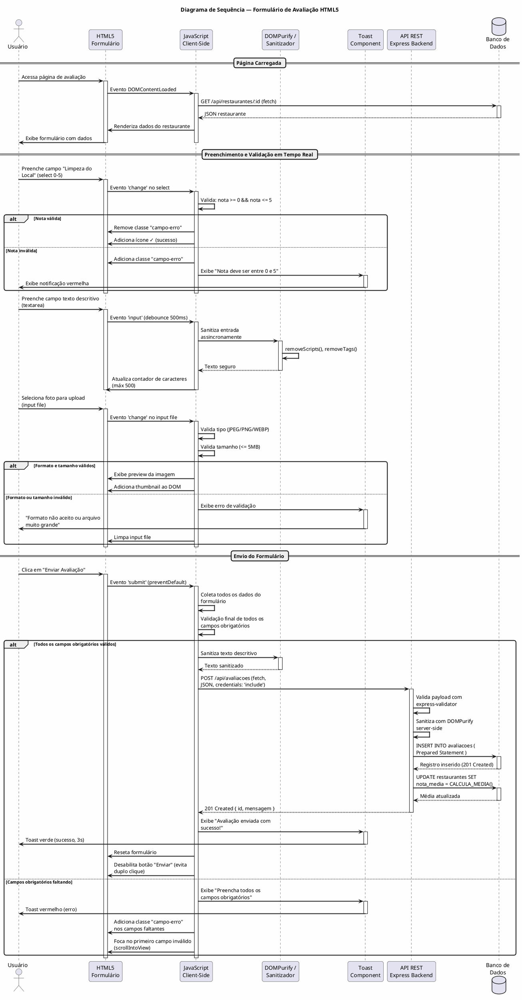
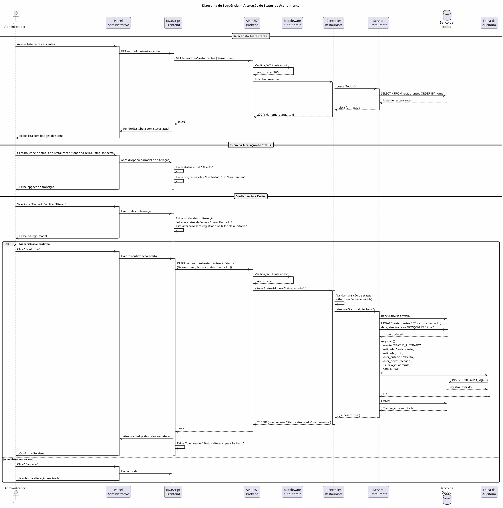
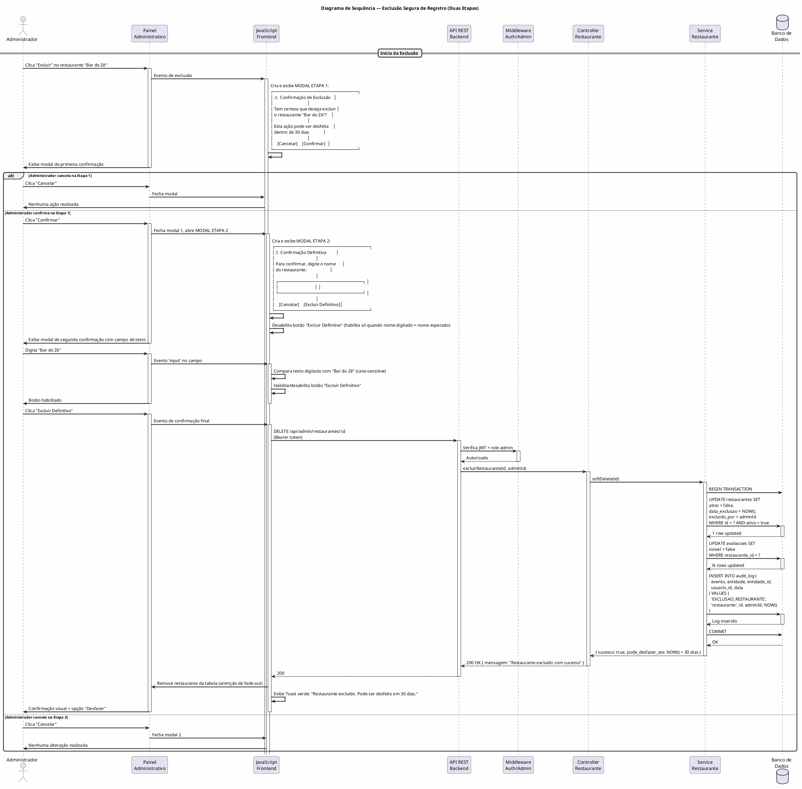

# Requisitos de Usuário — SwipFood

**Projeto:** SwipFood — Plataforma de Avaliação de Restaurantes  
**Normas de Referência:** OMG UML 2.5.1 · ISO/IEC/IEEE 29148:2018 · ISO/IEC 25010 / FURPS+  
**Stack Tecnológica:** Frontend HTML5 semântico, CSS3, JavaScript Vanilla/ES6+ · Backend Node.js com Express · SQLite/PostgreSQL com Prepared Statements  
**Versão do Documento:** 1.0  
**Data:** 10/09/2026  

---

## Índice

1. [Introdução](#1-introdução)
2. [Identificação e Caracterização Formal dos Atores](#2-identificação-e-caracterização-formal-dos-atores)
3. [Diagrama de Casos de Uso — PlantUML](#3-diagrama-de-casos-de-uso--plantuml)
4. [Catálogo Detalhado de Requisitos de Usuário (RU)](#4-catálogo-detalhado-de-requisitos-de-usuário-ru)
5. [Histórias de Usuário com Critérios de Aceite BDD / Gherkin](#5-histórias-de-usuário-com-critérios-de-aceite-bdd--gherkin)
6. [Diagramas de Sequência — PlantUML](#6-diagramas-de-sequência--plantuml)

---

## 1. Introdução

Este documento especifica os requisitos de usuário do sistema **SwipFood**, uma plataforma web full-stack que permite aos usuários descobrir, avaliar e recomendar restaurantes com base em critérios subjetivos e objetivos relacionados à qualidade da comida e ao ambiente do estabelecimento.

O público-alvo são consumidores que buscam recomendações confiáveis sobre restaurantes, considerando atributos como higiene, sabor, preço, odor, aspecto visual, proporção das porções, e também características do ambiente como conforto, limpeza, iluminação, ambientação, atendimento, localização, estacionamento, espaço infantil e segurança.

O sistema é acessível via navegador web (responsivo) e opera com arquitetura client-server, onde o frontend é constituído por páginas HTML5 semântico com CSS3 e JavaScript Vanilla/ES6+, e o backend é um servidor Node.js com Express conectado a um banco de dados relacional (SQLite para desenvolvimento / PostgreSQL para produção).

---

## 2. Identificação e Caracterização Formal dos Atores

Conforme a especificação UML 2.5.1 (Section 18.2), um **ator** representa um papel que um usuário externo humano ou sistema desempenha ao interagir com o sistema. Atores são classificados em **primários** (iniciam a interação), **secundários** (participam da interação de forma reativa) e **sistêmicos** (representam outros sistemas ou componentes externos).

### 2.1 Atores Humanos Primários

| ID | Ator | Descrição | Estereótipo |
|----|------|-----------|-------------|
| AP-01 | **Usuário Autenticado** | Pessoa física que possui cadastro no sistema, realizou login e está autenticada. Pode avaliar restaurantes, pesquisar, favoritar e gerenciar seu próprio perfil. Inicia interações com o sistema (busca, avaliação, alteração de dados). | `<<primary>>` |
| AP-02 | **Administrador** | Pessoa com credenciais de administrador que gerencia todo o ciclo de vida do sistema: cadastro, edição e exclusão de restaurantes, moderação de avaliações, gestão de usuários e acompanhamento de métricas operacionais. Inicia operações administrativas críticas. | `<<primary>>` |

### 2.2 Atores Humanos Secundários

| ID | Ator | Descrição | Estereótipo |
|----|------|-----------|-------------|
| AS-01 | **Usuário Visitante (Não Autenticado)** | Pessoa que acessa o sistema sem autenticar-se. Pode visualizar a listagem pública de restaurantes e seus dados resumidos (nome, nota média, faixa de preço, endereço), mas não pode avaliar, comentar ou acessar funcionalidades restritas. Participa da interação de forma passiva. | `<<secondary>>` |

### 2.3 Atores Sistêmicos

| ID | Ator | Descrição | Estereótipo |
|----|------|-----------|-------------|
| AT-01 | **Banco de Dados Relacional (SQLite/PostgreSQL)** | Componente de persistência que armazena todas as entidades do domínio (restaurantes, avaliações, usuários, categorias, fotos). Responde a consultas via Prepared Statements/ORM e garante integridade referencial e transacional. | `<<system>>` |
| AT-02 | **Serviço de Mapas (Google Maps / OpenStreetMap API)** | API externa consumida via HTTP/HTTPS para geolocalização, cálculo de distância entre o usuário e o restaurante, e exibição de mapa interativo. Recurso externo indisponível para controle do sistema. | `<<external>>` |
| AT-03 | **Serviço de Hashing de Senhas (bcrypt/argon2)** | Biblioteca/módulo interno do backend responsável por gerar salt aleatório e hash da senha do usuário durante cadastro e verificação durante login. Ator sistêmico passivo invocado pelo controller de autenticação. | `<<system>>` |
| AT-04 | **Serviços CDN (Imagens)** | Rede de distribuição de conteúdo para servir imagens estáticas (fotos de pratos, logos de restaurantes) de forma otimizada com cache geográfico. | `<<external>>` |

---

## 3. Diagrama de Casos de Uso — PlantUML

O diagrama a seguir delimita a fronteira do sistema (**System Boundary**) e representa todos os casos de uso relevantes para os atores identificados, utilizando os estereótipos canônicos `<<include>>` e `<<extend>>` conforme UML 2.5.1 §18.3.

```plantuml
@startuml
left to right direction
skinparam packageStyle rectangle
skinparam actorStyle awesome
skinparam usecase {
  BackgroundColor #FEFECE
  BorderColor #A80036
  ArrowColor #333333
}
skinparam rectangle {
  BackgroundColor #E8F5E9
  BorderColor #2E7D32
}

title Diagrama de Casos de Uso — SwipFood

rectangle "Sistema SwipFood" as SWIPFOOD {

  ' === Casos de Uso para Usuário Visitante ===
  usecase "Pesquisar Restaurantes" as UC01
  usecase "Visualizar Dados do Restaurante" as UC02
  usecase "Visualizar Nota Média" as UC03

  ' === Casos de Uso para Usuário Autenticado ===
  usecase "Cadastrar Conta" as UC04
  usecase "Autenticar (Login)" as UC05
  usecase "Avaliar Restaurante" as UC06
  usecase "Avaliar Qualidade da Comida" as UC06a
  usecase "Avaliar Qualidade do Ambiente" as UC06b
  usecase "Filtrar por Faixa de Preço" as UC07
  usecase "Filtrar por Características do Ambiente" as UC08
  usecase "Favoritar Restaurante" as UC09
  usecase "Gerenciar Perfil" as UC10
  usecase "Logout" as UC11
  usecase "Visualizar Histórico de Avaliações" as UC12

  ' === Casos de Uso para Administrador ===
  usecase "Gerenciar Restaurantes" as UC13
  usecase "Cadastrar Restaurante" as UC13a
  usecase "Editar Restaurante" as UC13b
  usecase "Excluir Restaurante" as UC13c
  usecase "Alterar Status de Atendimento" as UC14
  usecase "Moderar Avaliações" as UC15
  usecase "Gerenciar Usuários" as UC16
  usecase "Visualizar Dashboard Administrativo" as UC17
  usecase "Gerar Relatórios" as UC18

  ' === Casos de Uso Incluídos ===
  usecase "Validar Dados de Entrada" as UC_VAL
  usecase "Sanitizar Conteúdo" as UC_SAN
  usecase "Verificar Autenticação" as UC_AUTH
  usecase "Verificar Autorização Admin" as UC_ADM
  usecase "Registrar Auditoria" as UC_AUD

  ' === Relationships Usuário Visitante ===
  AS01 --> UC01
  AS01 --> UC02
  AS01 --> UC03

  ' === Relationships Usuário Autenticado ===
  AP01 --> UC04
  AP01 --> UC05
  AP01 --> UC06
  AP01 --> UC07
  AP01 --> UC08
  AP01 --> UC09
  AP01 --> UC10
  AP01 --> UC11
  AP01 --> UC12

  ' === Relationships Administrador ===
  AP02 --> UC13
  AP02 --> UC14
  AP02 --> UC15
  AP02 --> UC16
  AP02 --> UC17
  AP02 --> UC18

  ' === Decomposição de Avaliar Restaurante ===
  UC06 ..> UC06a : <<include>>
  UC06 ..> UC06b : <<include>>

  ' === Include relationships ===
  UC05 ..> UC_VAL : <<include>>
  UC06 ..> UC_VAL : <<include>>
  UC06 ..> UC_SAN : <<include>>
  UC13a ..> UC_VAL : <<include>>
  UC13a ..> UC_SAN : <<include>>
  UC13b ..> UC_VAL : <<include>>
  UC13c ..> UC_ADM : <<include>>
  UC14 ..> UC_ADM : <<include>>
  UC14 ..> UC_AUD : <<include>>
  UC15 ..> UC_ADM : <<include>>
  UC16 ..> UC_ADM : <<include>>
  UC05 ..> UC_AUTH : <<include>>
  UC06 ..> UC_AUTH : <<include>>
  UC14 ..> UC_AUTH : <<include>>

  ' === Extend relationships ===
  UC07 ..> UC01 : <<extend>>
  UC08 ..> UC01 : <<extend>>
  UC12 ..> UC10 : <<extend>>
  UC18 ..> UC17 : <<extend>>
}

' === Atores ===
actor "Usuário Visitante" as AS01
actor "Usuário Autenticado" as AP01
actor "Administrador" as AP02

@enduml
```

### 3.1 Legenda dos Relacionamentos

| Tipo | Notação | Significado |
|------|---------|-------------|
| `<<include>>` | Seta tracejada com estereótipo | O caso de uso base **sempre** inclui o comportamento do caso incluído. É uma dependência obrigatória. |
| `<<extend>>` | Seta tracejada com estereótipo | O caso de uso extensor **opcionalmente** adiciona comportamento ao caso base, sob certa condição. |

### 3.2 Descrição dos Casos de Uso Principais

#### UC01 — Pesquisar Restaurantes

| Campo | Descrição |
|-------|-----------|
| **Nome** | Pesquisar Restaurantes |
| **ID** | UC01 |
| **Atores** | Usuário Visitante, Usuário Autenticado, Administrador |
| **Pré-condições** | Nenhuma (acesso público) |
| **Pós-condições** | Lista de restaurantes exibida com dados resumidos |
| **Fluxo Principal** | 1. O ator acessa a página inicial; 2. O sistema exibe a listagem de restaurantes com filtros disponíveis; 3. O ator insere termo de busca e/ou seleciona filtros (faixa de preço, estacionamento, espaço infantil); 4. O sistema consulta o banco de dados e retorna os restaurantes que atendem aos critérios; 5. O sistema exibe os resultados com nome, nota média, foto e faixa de preço. |
| **Fluxos Alternativos** | 5a. Nenhum restaurante encontrado → o sistema exibe mensagem "Nenhum restaurante encontrado para os critérios informados." |
| **Fluxos de Exceção** | Erro de conexão com o banco → o sistema exibe mensagem de erro amigável e loga o erro no servidor. |

#### UC06 — Avaliar Restaurante

| Campo | Descrição |
|-------|-----------|
| **Nome** | Avaliar Restaurante |
| **ID** | UC06 |
| **Atores** | Usuário Autenticado (ator principal) |
| **Relacionamentos** | `<<include>>` UC06a (Avaliar Qualidade da Comida), `<<include>>` UC06b (Avaliar Qualidade do Ambiente), `<<include>>` UC_VAL (Validar Dados), `<<include>>` UC_SAN (Sanitizar Conteúdo), `<<include>>` UC_AUTH (Verificar Autenticação) |
| **Pré-condições** | Usuário autenticado; restaurante selecionado existe no sistema |
| **Pós-condições** | Avaliação registrada no banco de dados; nota média do restaurante recalculada |
| **Fluxo Principal** | 1. O usuário seleciona um restaurante; 2. O sistema verifica autenticação (UC_AUTH); 3. O sistema exibe o formulário de avaliação; 4. O usuário preenche os campos: nota Limpeza do Local (0–5), nota Manuseio dos Alimentos (0–5), nota Odor do Ambiente/Comida (0–5), nota Iluminação (0–5), nota Limpeza Geral (0–5), nota Velocidade do Atendimento (0–5), nota Cordialidade do Atendimento (0–5), nota Relação Custo-Benefício (0–5), texto descritivo opcional, upload de fotos dos pratos (opcional); 5. O sistema valida os dados (UC_VAL); 6. O sistema sanitiza o conteúdo textual (UC_SAN); 7. O sistema persiste a avaliação no banco de dados; 8. O sistema recalcula e atualiza a nota média do restaurante; 9. O sistema confirma sucesso ao usuário. |
| **Fluxos Alternativos** | 4a. Usuário não envia fotos → campo foto fica NULL; 4b. Usuário não escreve texto descritivo → campo texto fica vazio. |
| **Fluxos de Exceção** | 5a. Nota fora do intervalo 0–5 → erro de validação; 6a. Conteúdo com scripts/maliciosos → sanitizado e registrado; 7a. Falha de persistência → transação revertida, mensagem de erro exibida. |

#### UC14 — Alterar Status de Atendimento

| Campo | Descrição |
|-------|-----------|
| **Nome** | Alterar Status de Atendimento |
| **ID** | UC14 |
| **Atores** | Administrador (ator principal) |
| **Relacionamentos** | `<<include>>` UC_ADM, `<<include>>` UC_AUTH, `<<include>>` UC_AUD |
| **Pré-condições** | Administrador autenticado com perfil verificado; restaurante selecionado |
| **Pós-condições** | Status do restaurante atualizado (Aberto / Fechado / Em Manutenção); trilha de auditoria registrada |
| **Fluxo Principal** | 1. O administrador acessa o painel de gerenciamento; 2. O sistema verifica autorização de admin (UC_ADM); 3. O administrador seleciona um restaurante; 4. O sistema exibe o status atual e as opções de transição válidas; 5. O administrador seleciona o novo status; 6. O sistema solicita confirmação; 7. O administrador confirma; 8. O sistema atualiza o registro no banco de dados; 9. O sistema registra a trilha de auditoria (UC_AUD); 10. O sistema confirma sucesso. |

#### UC13c — Excluir Restaurante

| Campo | Descrição |
|-------|-----------|
| **Nome** | Excluir Restaurante |
| **ID** | UC13c |
| **Atores** | Administrador (ator principal) |
| **Relacionamentos** | `<<include>>` UC_ADM, `<<include>>` UC_AUTH |
| **Pré-condições** | Administrador autenticado; restaurante selecionado existe |
| **Pós-condições** | Restaurante removido do banco de dados (soft delete); todas as avaliações associadas arquivadas |
| **Fluxo Principal** | 1. O administrador seleciona um restaurante na listagem; 2. O administrador clica em "Excluir"; 3. O sistema exibe diálogo modal de confirmação em duas etapas: "Tem certeza que deseja excluir este restaurante? Esta ação pode ser desfeita dentro de 30 dias."; 4. O administrador confirma a primeira etapa; 5. O sistema exibe segunda confirmação: "Digite o nome do restaurante para confirmar a exclusão definitiva"; 6. O administrador digita o nome; 7. O sistema valida o nome digitado; 8. O sistema executa soft delete; 9. O sistema confirma exclusão. |

---

## 4. Catálogo Detalhado de Requisitos de Usuário (RU)

A tabela abaixo lista todos os requisitos de usuário seguindo a estrutura: **ID**, **Caso de Uso Associado**, **Ator Principal**, **Prioridade (MoSCoW)**, **Pré-condições**, **Fluxo Operacional** e **Pós-condições**.

### 4.1 Requisitos — Encontrar Boa Comida

| ID RU | Caso de Uso | Ator | Prioridade | Pré-condições | Fluxo Operacional | Pós-condições |
|-------|-------------|------|------------|---------------|-------------------|---------------|
| RU-001 | UC01 / UC06 | AP01 | **Must Have** | Usuário autenticado; restaurante selecionado | 1. Usuário acessa formulário de avaliação; 2. Usuário seleciona nota (0–5) para "Limpeza do Local"; 3. Usuário seleciona nota (0–5) para "Manuseio dos Alimentos"; 4. Usuário opcionalmente escreve texto descritivo; 5. Usuário opcionalmente faz upload de fotos; 6. Usuário envia o formulário; 7. Sistema valida, sanitiza e persiste. | Avaliação registrada; nota média recalculada. |
| RU-002 | UC06 | AP01 | **Must Have** | Usuário autenticado | 1. Usuário preenche formulário; 2. Usuário insere nota numérica (0–5); 3. Usuário opcionalmente insere texto descritivo; 4. Sistema valida formato numérico; 5. Sistema sanitiza texto; 6. Sistema persiste. | Avaliação com nota numérica e opcional texto armazenados. |
| RU-003 | UC01 / UC07 | AS01 / AP01 | **Must Have** | Nenhuma | 1. Usuário seleciona filtro de faixa de preço; 2. Sistema exibe opções: "R$ 0–10", "R$ 10–30", "R$ 30–60", "R$ 60+"; 3. Usuário seleciona uma ou mais faixas; 4. Sistema filtra e exibe restaurantes correspondentes. | Lista filtrada por faixa de preço exibida. |
| RU-004 | UC06 | AP01 | **Should Have** | Usuário autenticado | 1. Usuário abre formulário de avaliação; 2. Usuário seleciona nota (0–5) para "Odor do Ambiente/Comida"; 3. Sistema registra junto com demais notas. | Campo de odor preenchido na avaliação. |
| RU-005 | UC06 | AP01 | **Could Have** | Usuário autenticado | 1. Usuário clica em "Adicionar Foto"; 2. Sistema abre seletor de arquivo; 3. Usuário seleciona arquivo (JPEG, PNG, WEBP ≤ 5MB); 4. Sistema valida formato e tamanho; 5. Sistema faz upload; 6. Sistema exibe preview. | Foto vinculada à avaliação; arquivo armazenado. |
| RU-006 | UC06 | AP01 | **Must Have** | Usuário autenticado | 1. Usuário seleciona nota (0–5) para "Relação Custo-Benefício"; 2. Sistema valida intervalo; 3. Sistema persiste. | Nota de custo-benefício registrada. |

### 4.2 Requisitos — Encontrar Locais Agradáveis

| ID RU | Caso de Uso | Ator | Prioridade | Pré-condições | Fluxo Operacional | Pós-condições |
|-------|-------------|------|------------|---------------|-------------------|---------------|
| RU-007 | UC13a / UC13b | AP02 | **Could Have** | Admin autenticado | 1. Admin acessa formulário de cadastro/edição; 2. Admin preenche "Capacidade de Pessoas" (numérico); 3. Admin seleciona "Tipo de Assento" (cadeira, sofá, banquetas, misto); 4. Sistema valida e persiste. | Dados de capacidade e assento cadastrados. |
| RU-008 | UC13a | AP02 | **Should Have** | Admin autenticado | 1. Admin acessa cadastro; 2. Admin seleciona opção binária (Sim/Não) para campos ambientais opcionais (ex.: "Cozinha Transparente", "Música Ao Vivo"); 3. Sistema persiste como booleano. | Campos binários do restaurante preenchidos. |
| RU-009 | UC06 | AP01 | **Must Have** | Usuário autenticado | 1. Usuário acessa formulário; 2. Usuário seleciona nota (0–5) para "Limpeza Geral"; 3. Sistema valida; 4. Sistema persiste. | Nota de limpeza geral registrada. |
| RU-010 | UC06 | AP01 | **Should Have** | Usuário autenticado | 1. Usuário seleciona nota (0–5) para "Iluminação"; 2. Sistema valida; 3. Sistema persiste. | Nota de iluminação registrada. |
| RU-011 | UC01 / UC08 | AS01 / AP01 | **Should Have** | Nenhuma | 1. Usuário acessa filtros de busca; 2. Sistema exibe campo de tags com sugestões: "Rústico", "Moderno", "Família", "Romântico", "Tradicional", "Gourmet"; 3. Usuário seleciona uma ou mais tags; 4. Sistema filtra restaurantes pelas tags selecionadas. | Lista filtrada por tags exibida. |
| RU-012 | UC06 | AP01 | **Must Have** | Usuário autenticado | 1. Usuário seleciona nota (0–5) para "Velocidade do Atendimento"; 2. Usuário seleciona nota (0–5) para "Cordialidade do Atendimento"; 3. Sistema valida; 4. Sistema persiste. | Notas de atendimento registradas. |
| RU-013 | UC01 / UC02 | AS01 / AP01 | **Must Have** | Nenhuma | 1. Sistema obtém geolocalização do usuário (com permissão); 2. Sistema consulta API de mapas (UC02); 3. Sistema calcula distância entre usuário e restaurante; 4. Sistema exibe mapa estático/interativo com pin do restaurante; 5. Sistema exibe endereço completo e distância em km. | Mapa e distância exibidos para o usuário. |
| RU-014 | UC13a / UC13b | AP02 | **Must Have** | Admin autenticado | 1. Admin acessa cadastro do restaurante; 2. Admin seleciona opção de estacionamento: "Próprio", "Convênio", "Valet", "Não possui"; 3. Sistema valida; 4. Sistema persiste. | Opção de estacionamento cadastrada. |
| RU-015 | UC13a / UC13b | AP02 | **Must Have** | Admin autenticado | 1. Admin acessa cadastro; 2. Admin seleciona opção de espaço infantil: "Sim", "Não", "Área kids com monitor"; 3. Sistema valida; 4. Sistema persiste. | Opção de espaço infantil cadastrada. |
| RU-016 | UC06 | AP01 | **Could Have** | Usuário autenticado | 1. Usuário seleciona nota (0–5) para "Segurança do Entorno"; 2. Usuário marca checkbox "Estacionamento Vigiado" (Sim/Não); 3. Sistema persiste. | Nota de segurança e status de estacionamento vigiado registrados. |

### 4.3 Requisitos — Funcionalidades Transversais

| ID RU | Caso de Uso | Ator | Prioridade | Pré-condições | Fluxo Operacional | Pós-condições |
|-------|-------------|------|------------|---------------|-------------------|---------------|
| RU-017 | UC04 | AS01 | **Must Have** | Nenhuma | 1. Visitante clica em "Criar Conta"; 2. Visitante preenche nome, e-mail, senha; 3. Sistema valida dados (UC_VAL); 4. Sistema hashifica senha (bcrypt); 5. Sistema persiste usuário; 6. Sistema envia e-mail de confirmação (futuro); 7. Sistema redireciona para login. | Conta criada; e-mail confirmado. |
| RU-018 | UC05 | AS01 | **Must Have** | Nenhuma | 1. Usuário insere e-mail e senha; 2. Sistema valida entrada; 3. Sistema busca usuário no banco; 4. Sistema compara hash da senha; 5. Sistema gera JWT; 6. Sistema armazena token em cookie HTTP-Only; 7. Sistema redireciona para dashboard. | Sessão autenticada iniciada. |
| RU-019 | UC10 | AP01 | **Must Have** | Usuário autenticado | 1. Usuário acessa "Meu Perfil"; 2. Sistema exibe dados atuais; 3. Usuário edita campos (nome, foto, biografia); 4. Sistema valida e persiste; 5. Sistema confirma atualização. | Perfil atualizado. |
| RU-020 | UC09 | AP01 | **Could Have** | Usuário autenticado | 1. Usuário clica em ícone de favorito no card do restaurante; 2. Sistema registra favoritação; 3. Ícone muda para estado preenchido. | Restaurante adicionado aos favoritos. |
| RU-021 | UC12 | AP01 | **Could Have** | Usuário autenticado | 1. Usuário acessa "Minhas Avaliações"; 2. Sistema lista todas as avaliações do usuário com data, restaurante e notas; 3. Usuário pode editar ou excluir sua avaliação. | Histórico exibido; edição/exclusão permitida. |
| RU-022 | UC11 | AP01 | **Must Have** | Usuário autenticado | 1. Usuário clica em "Sair"; 2. Sistema invalida token JWT; 3. Sistema limpa cookie; 4. Sistema redireciona para página inicial. | Sessão encerrada. |

---

## 5. Histórias de Usuário com Critérios de Aceite BDD / Gherkin

As histórias de usuário seguem o formato **"Como [ator], quero [funcionalidade], para [benefício]"** e são acompanhadas de critérios de aceite em formato BDD/Gherkin (**Dado / Quando / Então**).

---

### HU-001: Avaliar Qualidade da Comida

**Como** Usuário Autenticado,  
**quero** avaliar um restaurante com notas de 0 a 5 para "Limpeza do Local" e "Manuseio dos Alimentos",  
**para** contribuir com recomendações confiáveis baseadas na qualidade da comida.

```gherkin
Funcionalidade: Avaliação da Qualidade da Comida
  Como usuário autenticado
  Quero atribuir notas numéricas à comida
  Para ajudar outros usuários a escolherem bons restaurantes

  Cenário: Avaliação com notas válidas
    Dado que o usuário está autenticado no sistema
    E que o usuário selecionou o restaurante "Sabor da Terra"
    Quando o usuário seleciona nota 5 para "Limpeza do Local"
    E o usuário seleciona nota 4 para "Manuseio dos Alimentos"
    E o usuário envia o formulário de avaliação
    Então o sistema deve registrar a avaliação com sucesso
    E a nota média do restaurante deve ser recalculada
    E uma mensagem de confirmação deve ser exibida

  Cenário: Tentativa de avaliação com nota fora do intervalo
    Dado que o usuário está autenticado no sistema
    E que o usuário está no formulário de avaliação
    Quando o usuário tenta inserir nota 6 para "Limpeza do Local"
    Então o sistema deve exibir mensagem de erro "Nota deve ser entre 0 e 5"
    E a avaliação não deve ser enviada

  Cenário: Avaliação sem preenchimento de campo obrigatório
    Dado que o usuário está autenticado no sistema
    E que o usuário preencheu apenas a nota de "Limpeza do Local"
    Quando o usuário tenta enviar o formulário sem preencher "Manuseio dos Alimentos"
    Então o sistema deve exibir erro de validação no campo obrigatório
    E o formulário não deve ser submetido

  Cenário: Avaliação com texto descritivo opcional
    Dado que o usuário está autenticado no sistema
    E que o usuário preencheu todas as notas obrigatórias
    Quando o usuário insere o texto "Comida excelente, porções generosas"
    E envia o formulário
    Então o sistema deve sanitizar o texto contra XSS
    E armazenar o texto descritivo junto com a avaliação
```

---

### HU-002: Avaliar Qualidade do Ambiente

**Como** Usuário Autenticado,  
**quero** avaliar um restaurante com notas de 0 a 5 para "Limpeza Geral", "Iluminação", "Velocidade do Atendimento" e "Cordialidade do Atendimento",  
**para** compartilhar minha experiência sobre o ambiente e o atendimento.

```gherkin
Funcionalidade: Avaliação da Qualidade do Ambiente
  Como usuário autenticado
  Quero atribuir notas ao ambiente e atendimento
  Para ajudar outros usuários a encontrarem locais agradáveis

  Cenário: Avaliação completa do ambiente
    Dado que o usuário está autenticado no sistema
    E que o usuário selecionou o restaurante "Casa do Sabor"
    Quando o usuário seleciona nota 5 para "Limpeza Geral"
    E o usuário seleciona nota 4 para "Iluminação"
    E o usuário seleciona nota 3 para "Velocidade do Atendimento"
    E o usuário seleciona nota 5 para "Cordialidade do Atendimento"
    E o usuário envia o formulário
    Então o sistema deve registrar todas as notas da avaliação
    E a média do restaurante deve ser atualizada

  Cenário: Avaliação parcial (apenas campos obrigatórios)
    Dado que o usuário está autenticado no sistema
    E que o usuário está no formulário de avaliação
    Quando o usuário preenche apenas "Limpeza Geral", "Velocidade" e "Cordialidade"
    E omite "Iluminação"
    E envia o formulário
    Então o sistema deve aceitar a avaliação
    E o campo "Iluminação" deve ficar com valor NULL
```

---

### HU-003: Filtrar Restaurantes por Faixa de Preço

**Como** Usuário Autenticado (ou Visitante),  
**quero** filtrar restaurantes por faixa de preço,  
**para** encontrar opções dentro do meu orçamento.

```gherkin
Funcionalidade: Filtragem por Faixa de Preço
  Como usuário da plataforma
  Quero filtrar restaurantes por faixa de preço
  Para encontrar opções compatíveis com meu orçamento

  Cenário: Filtrar por faixa de preço única
    Dado que o usuário está na página de listagem de restaurantes
    Quando o usuário seleciona a faixa "R$ 10–30"
    Então o sistema deve exibir apenas restaurantes com preço médio dentro dessa faixa
    E a listagem deve ser atualizada sem recarregar a página

  Cenário: Filtrar por múltiplas faixas de preço
    Dado que o usuário está na página de listagem
    Quando o usuário seleciona as faixas "R$ 10–30" e "R$ 30–60"
    Então o sistema deve exibir restaurantes que se enquadram em qualquer uma das faixas selecionadas

  Cenário: Nenhum restaurante encontrado na faixa
    Dado que o usuário selecionou a faixa "R$ 60+"
    E que não há restaurantes com preço nessa faixa
    Quando o sistema processa o filtro
    Então o sistema deve exibir a mensagem "Nenhum restaurante encontrado para a faixa de preço selecionada"
```

---

### HU-004: Autenticar via Login

**Como** Usuário,  
**quero** fazer login com meu e-mail e senha,  
**para** acessar funcionalidades restritas como avaliação e favoritos.

```gherkin
Funcionalidade: Autenticação de Usuário
  Como usuário com conta cadastrada
  Quero autenticar-me via login
  Para acessar funcionalidades protegidas

  Cenário: Login com credenciais válidas
    Dado que o usuário possui conta no sistema
    E que o usuário está na página de login
    Quando o usuário insere e-mail "usuario@email.com" e senha "Senha@123"
    E clica em "Entrar"
    Então o sistema deve validar as credenciais
    E gerar um token JWT válido
    E armazenar o token em cookie HTTP-Only
    E redirecionar o usuário para a página inicial autenticada

  Cenário: Login com senha incorreta
    Dado que o usuário está na página de login
    Quando o usuário insere e-mail válido e senha incorreta
    Então o sistema deve exibir mensagem "E-mail ou senha incorretos"
    E não deve revelar qual campo está incorreto
    E deve registrar a tentativa na trilha de auditoria

  Cenário: Login com e-mail inexistente
    Dado que o usuário está na página de login
    Quando o usuário insere e-mail "naoexiste@email.com"
    Então o sistema deve exibir mensagem genérica "E-mail ou senha incorretos"
```

---

### HU-005: Alterar Status de Atendimento

**Como** Administrador,  
**quero** alterar o status de atendimento de um restaurante (Aberto / Fechado / Em Manutenção),  
**para** manter as informações de disponibilidade atualizadas para os usuários.

```gherkin
Funcionalidade: Alteração de Status de Atendimento
  Como administrador autenticado
  Quero alterar o status de um restaurante
  Para manter informações precisas para os usuários

  Cenário: Alterar status de Aberto para Fechado
    Dado que o administrador está autenticado no painel administrativo
    E que o restaurante "Sabor da Terra" possui status "Aberto"
    Quando o administrador seleciona o restaurante
    E seleciona o novo status "Fechado"
    E confirma a alteração no diálogo de confirmação
    Então o sistema deve atualizar o status para "Fechado"
    E registrar a trilha de auditoria com data, hora e responsável
    E exibir confirmação "Status atualizado com sucesso"

  Cenário: Cancelar alteração de status
    Dado que o administrador está no diálogo de confirmação
    Quando o administrador clica em "Cancelar"
    Então o sistema deve fechar o diálogo
    E não deve alterar o status do restaurante

  Cenário: Tentativa de alteração sem autorização
    Dado que um usuário comum (não administrador) tenta acessar a rota de alteração de status
    Quando o sistema verifica a autorização
    Então o sistema deve retornar erro 403 Forbidden
    E não deve permitir a alteração
```

---

### HU-006: Excluir Restaurante com Confirmação em Duas Etapas

**Como** Administrador,  
**quero** excluir um restaurante com confirmação em duas etapas,  
**para** prevenir exclusões acidentais de registros importantes.

```gherkin
Funcionalidade: Exclusão Segura de Restaurante
  Como administrador autenticado
  Quero excluir um restaurante com dupla confirmação
  Para evitar exclusões acidentais

  Cenário: Exclusão bem-sucedida com confirmação completa
    Dado que o administrador está autenticado no painel
    E que o restaurante "Bar do Zé" está selecionado
    Quando o administrador clica em "Excluir"
    Então o sistema deve exibir primeira confirmação:
      """
      Tem certeza que deseja excluir este restaurante?
      Esta ação pode ser desfeita dentro de 30 dias.
      """
    Quando o administrador confirma a primeira etapa
    Então o sistema deve exibir segunda confirmação:
      """
      Digite o nome do restaurante para confirmar a exclusão definitiva:
      """
    Quando o administrador digita "Bar do Zé" corretamente
    Então o sistema deve executar soft delete do restaurante
    E exibir mensagem "Restaurante excluído com sucesso"

  Cenário: Nome digitado incorretamente na segunda confirmação
    Dado que o administrador está na segunda etapa de confirmação
    Quando o administrador digita "Bar do Ze" (sem acento)
    Então o sistema deve exibir erro "Nome não confere. Exclusão cancelada."
    E o restaurante não deve ser excluído

  Cenário: Cancelamento na primeira confirmação
    Dado que o administrador está na primeira etapa de confirmação
    Quando o administrador clica em "Cancelar"
    Então o sistema deve fechar o diálogo sem alterações
```

---

### HU-007: Upload de Fotos dos Pratos

**Como** Usuário Autenticado,  
**quero** fazer upload de fotos dos pratos que pedi,  
**para** enriquecer minha avaliação com evidências visuais.

```gherkin
Funcionalidade: Upload de Fotos na Avaliação
  Como usuário autenticado
  Quero anexar fotos à minha avaliação
  Para torná-la mais completa e visual

  Cenário: Upload de foto válida
    Dado que o usuário está no formulário de avaliação
    Quando o usuário seleciona arquivo "prato.jpg" (JPEG, 2MB)
    E clica em "Adicionar Foto"
    Então o sistema deve validar o formato (JPEG, PNG ou WEBP)
    E validar o tamanho (≤ 5MB)
    E exibir preview da imagem
    E armazenar a referência no banco de dados

  Cenário: Upload de arquivo com formato inválido
    Dado que o usuário está no formulário de avaliação
    Quando o usuário seleciona arquivo "prato.exe"
    Então o sistema deve rejeitar o arquivo
    E exibir mensagem "Formato não aceito. Use JPEG, PNG ou WEBP."

  Cenário: Upload de arquivo excedendo tamanho máximo
    Dado que o usuário seleciona arquivo "foto_grande.jpg" (15MB)
    Quando o sistema valida o tamanho
    Então deve exibir mensagem "Arquivo excede o limite de 5MB"
    E não deve permitir o upload
```

---

### HU-008: Filtrar por Características do Ambiente

**Como** Usuário Autenticado,  
**quero** filtrar restaurantes por características como estacionamento, espaço infantil e tags de ambientação,  
**para** encontrar restaurantes que atendam às minhas necessidades específicas.

```gherkin
Funcionalidade: Filtragem por Características do Ambiente
  Como usuário da plataforma
  Quero filtrar restaurantes por características do ambiente
  Para encontrar locais agradáveis para minha necessidade

  Cenário: Filtrar por estacionamento próprio
    Dado que o usuário está na página de listagem
    Quando seleciona filtro "Estacionamento: Próprio"
    Então o sistema deve exibir apenas restaurantes com estacionamento próprio

  Cenário: Filtrar por espaço infantil com monitor
    Dado que o usuário está na página de listagem
    Quando seleciona filtro "Espaço Infantil: Área kids com monitor"
    Então o sistema deve exibir apenas restaurantes com essa opção

  Cenário: Filtros combinados
    Dado que o usuário seleciona "Faixa de preço: R$ 10–30"
    E seleciona "Estacionamento: Próprio"
    E seleciona "Tag: Família"
    Quando o sistema processa os filtros
    Então deve exibir apenas restaurantes que atendam a TODOS os critérios simultaneamente
```

---

### HU-009: Pesquisar Restaurantes por Proximidade

**Como** Usuário Autenticado,  
**quero** ver a distância entre minha localização e os restaurantes,  
**para** escolher opções próximas ao meu local atual.

```gherkin
Funcionalidade: Pesquisa por Proximidade
  Como usuário da plataforma
  Quero ver a distância até os restaurantes
  Para escolher opções próximas

  Cenário: Exibir distância na listagem
    Dado que o usuário concedeu permissão de geolocalização
    E que o usuário está na página de listagem
    Quando o sistema obtém a localização do usuário
    E consulta a API de mapas
    Então o sistema deve exibir a distância em km para cada restaurante
    E ordenar a listagem por proximidade (menor distância primeiro)

  Cenário: Exibir mapa e endereço ao detalhar restaurante
    Dado que o usuário clica em um restaurante da listagem
    Quando a página de detalhes é carregada
    Então o sistema deve exibir mapa com pin do restaurante
    E exibir endereço completo
    E exibir distância em linha reta até o restaurante
```

---

### HU-010: Gerenciar Perfil do Usuário

**Como** Usuário Autenticado,  
**quero** visualizar e editar meus dados de perfil,  
**para** manter minhas informações atualizadas no sistema.

```gherkin
Funcionalidade: Gerenciamento de Perfil
  Como usuário autenticado
  Quero gerenciar meus dados de perfil
  Para manter informações atualizadas

  Cenário: Visualizar perfil
    Dado que o usuário está autenticado
    Quando acessa "Meu Perfil"
    Then o sistema deve exibir nome, e-mail, data de cadastro e avaliações realizadas

  Cenário: Editar nome e biografia
    Dado que o usuário está na página de perfil
    Quando altera o nome para "João Silva"
    E insere biografia "Amante de comida japonesa"
    E salva as alterações
    Então o sistema deve validar os campos
    E persistir as alterações
    E exibir mensagem "Perfil atualizado com sucesso"
```

---

## 6. Diagramas de Sequência — PlantUML

### 6.1 Diagrama de Sequência — Formulário Público HTML5 com Validação Client-Side

Este DS descreve o fluxo de interação do usuário com o formulário público (página de avaliação), incluindo validação client-side via JavaScript, sanitização assíncrona e feedback via Toast/DOM.



### 6.2 Diagrama de Sequência — Fluxo de Login Administrativo

Este DS descreve o fluxo completo de autenticação administrativa, desde a submissão do formulário até a verificação de permissões e redirecionamento.

```plantuml
@startuml
skinparam backgroundColor #FEFEFE
skinparam sequenceArrowThickness 2
skinparam roundcorner 10

title Diagrama de Sequência — Login Administrativo com Sessão/Token

actor "Administrador" as Admin
participant "HTML5\nForm Login" as Form
participant "JavaScript\nClient-Side" as JS
participant "API REST\nExpress Backend" as API
participant "Middleware\nAuth" as Auth
participant "Controller\nAuth" as Ctrl
participant "Service\nAuth" as Svc
participant "bcrypt /\nargon2" as Hash
database "Banco de\nDados" as DB

== Exibição do Formulário ==

Admin -> Form : Acessa /admin/login
activate Form
Form -> JS : DOMContentLoaded
activate JS
JS -> Form : Renderiza formulário (e-mail, senha)
Form -> Admin : Exibe formulário de login
deactivate JS
deactivate Form

== Submissão do Login ==

Admin -> Form : Insere credenciais e clica "Entrar"
activate Form
Form -> JS : Evento 'submit'
activate JS
JS -> JS : Validação client-side: e-mail format, senha não vazia
JS -> API : POST /api/auth/login (JSON: { email, senha })
activate API

API -> Ctrl : Roteamento para loginHandler
activate Ctrl
Ctrl -> Ctrl : express-validator: valida body
alt Validação falhou
  Ctrl --> API : 400 Bad Request { erros }
  API --> JS : 400 { erros }
  JS -> Form : Exibe erros nos campos
  deactivate Ctrl
else Validação OK
  Ctrl -> Svc : autenticar(email, senha)
  activate Svc
  Svc -> DB : SELECT * FROM usuarios WHERE email = ? (Prepared Statement)
  activate DB
  DB --> Svc : Usuário encontrado ou null
  deactivate DB
  alt Usuário não encontrado
    Svc -> Svc : Comparação com hash vazio (timing-safe)
    Svc --> Ctrl : { erro: "Credenciais inválidas" }
    Ctrl --> API : 401 Unauthorized
    API --> JS : 401
    JS -> Form : Mensagem genérica "E-mail ou senha incorretos"
    deactivate Svc
  else Usuário encontrado
    Svc -> Hash : compare(senha, hash_armazenado)
    activate Hash
    Hash --> Svc : true/false
    deactivate Hash
    alt Senha incorreta
      Svc -> DB : INSERT INTO audit_log (evento: 'LOGIN_FALHA', email)
      Svc --> Ctrl : { erro: "Credenciais inválidas" }
      Ctrl --> API : 401 Unauthorized
      API --> JS : 401
      JS -> Form : "E-mail ou senha incorretos"
    else Senha correta
      alt Usuário é administrador
        Svc -> Svc : Gera JWT { sub: id, role: 'admin', exp: '24h' }
        Svc -> DB : INSERT INTO audit_log (evento: 'LOGIN_SUCESSO', usuario_id)
        Svc --> Ctrl : { token, usuario }
        Ctrl -> Auth : Define cookie HTTP-Only: token=JWT; HttpOnly; Secure; SameSite=Strict
        Ctrl --> API : 200 OK { token, usuario: { id, nome, role } }
        API --> JS : 200
        JS -> JS : Armazena dados do usuário em sessionStorage
        JS -> JS : window.location.href = '/admin/dashboard'
        deactivate Svc
      else Usuário não é administrador
        Svc --> Ctrl : { erro: "Acesso não autorizado" }
        Ctrl --> API : 403 Forbidden
        API --> JS : 403
        JS -> Form : "Você não possui permissão de administrador"
      end
    end
  end
end
deactivate Ctrl
deactivate API
deactivate JS
deactivate Form

== Verificação de Rota Protegida (Middleware) ==

[-> Auth : Requisição a /admin/* (com cookie token)
activate Auth
Auth -> Auth : Extrai token do cookie HTTP-Only
Auth -> Auth : Verifica assinatura JWT
Auth -> Auth : Decodifica payload { sub, role, exp }
Auth -> Auth : Verifica expiração
alt Token inválido ou expirado
  Auth --> [ : 401 Unauthorized / Redireciona para /admin/login
else Token válido
  Auth -> Auth : Verifica role === 'admin'
  alt Role não é admin
    Auth --> [ : 403 Forbidden
  else Role é admin
    Auth -> [ : Requisição passa para Controller
  end
end
deactivate Auth

@enduml
```

### 6.3 Diagrama de Sequência — Alteração de Status de Atendimento



### 6.4 Diagrama de Sequência — Exclusão Segura com Diálogo Modal em Duas Etapas



---

**Fim do Documento — Requisitos de Usuário**
